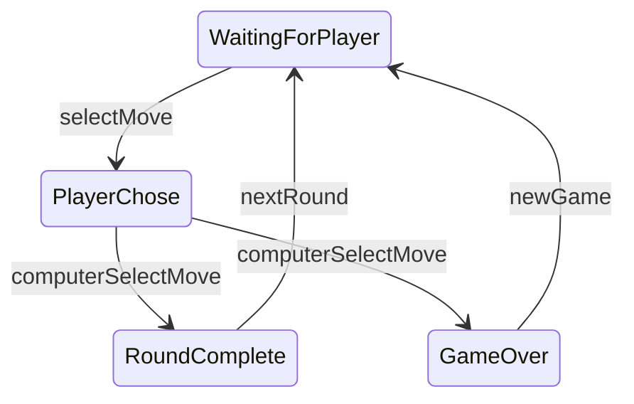

import { Tabs, TabItem } from '@astrojs/starlight/components';
import RockPaperScissorsExample from '@code/examples/rock-paper-scissors';
import machineCode from '@code/examples/rock-paper-scissors/machine.docs.ts?raw';
import indexCode from '@code/examples/rock-paper-scissors/index.tsx?raw';
import CodeBlock from '@components/CodeBlock.astro';

## Interactive Rock-Paper-Scissors Game

  <RockPaperScissorsExample client:visible />

## Introduction

This example demonstrates a Rock-Paper-Scissors game state machine that manages the game flow, tracks scores, and determines winners. It shows how state machines can handle complex conditional logic and state transitions in an interactive application.

## Machine Implementation

<CodeBlock code={machineCode} lang="js" title="machine.ts" />

  
Note

  

    The actual implementation imports from '@lib/src' which is aliased to the local library code.
  

## Component Integration

<CodeBlock code={indexCode} lang="tsx" title="index.tsx" />
