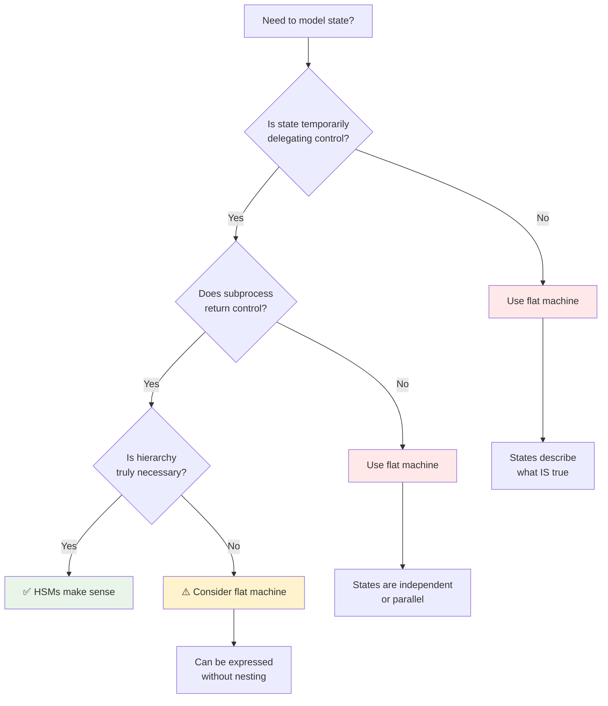

:::caution[Experimental Feature]
Hierarchical state machines are experimental in Matchina. The APIs may change and complex nested types may require explicit annotations.
:::

## What are Hierarchical Machines?

Hierarchical State Machines (HSMs) allow you to build complex state machines by nesting child machines within parent states. Matchina's approach **flattens** nested definitions into a single-level machine with dot-notation keys.

**Key benefits:**
- **Modular definition** - Define nested structure, run as flat machine
- **Simple runtime** - No nested machine instances to manage
- **Familiar events** - Same `send()` API, states like `"Working.Red"`

## When to Use Hierarchy

:::tip[Core Principle]
Use hierarchy only when a state temporarily takes control and must return control when finished. If states merely describe *what is true*, hierarchy is the wrong tool.
:::

**Good examples (temporary delegation):**
- **Traffic light** - `Working` contains `Red`/`Green`/`Yellow` cycle
- **Checkout flow** - `Payment` contains `MethodEntry`/`Authorizing`/`Authorized`
- **Search bar** - `Active` owns focus, contains `TextEntry`/`Results`

**Bad examples (semantic grouping):**
- **"Loading" nested under "Viewing"** when both can exist independently
- Using hierarchy as namespacing for unrelated concerns

## HSM Design Guidelines

### State Design Principles

**Prefer Simple States**
- Use simple states without parameters or typed payloads when possible
- Complex parameter threading reduces readability and reasoning
- Example: `Empty: () => ({})` instead of `Empty: (selectedTags: string[]) => ({ selectedTags })`

```typescript
// GOOD: Simple state without parameters
const states = defineStates({
  Empty: undefined,                    // No data needed for empty state
  Loading: () => ({ progress: 0 }),     // Progress tracks completion percentage (0-100)
  Error: (message: string) => ({ message }), // Error message for user display
});

// AVOID: Complex parameter threading
const states = defineStates({
  Empty: (selectedTags: string[], filterText: string, sortBy: SortOption) => ({
    selectedTags,    // Why does Empty need tags? Empty means no tags selected
    filterText,      // Why does Empty need filter? No text when empty
    sortBy          // Complex state makes reasoning hard - move to global context
  }),
});
```

**Present Tense Naming**
- Use present tense or gerunds: `Ready`, `Waiting`, `Loading`, `Saving`, `Typing`
- Avoid past tense states which can be ambiguous
- States should describe what the thing **IS**, not what it **WAS**

```typescript
// GOOD: Present tense states describe current condition
const states = defineStates({
  Loading: undefined,           // Currently loading
  Saving: undefined,           // Currently saving
  Error: (message: string) => ({ message }), // Currently in error state
  Ready: undefined,            // Currently ready for input
});

// AVOID: Past tense states are ambiguous
const states = defineStates({
  Loaded: undefined,           // Was loaded, but what's the current state?
  Saved: undefined,            // Was saved, but now what?
  Failed: undefined,           // Failed in the past, but what's happening now?
});
```

**Mutual Exclusivity**
- States must be mutually exclusive - no overlapping conditions
- Avoid states like `Selecting` AND `Suggesting` that can be true simultaneously
- Each state should represent a unique, non-overlapping condition

```typescript
// GOOD: Mutually exclusive states
const states = defineStates({
  Idle: undefined,              // Nothing happening - user inactive
  Selecting: (items: any[]) => ({ items }), // User actively selecting from options
  Suggesting: (suggestions: string[]) => ({ suggestions }), // Showing AI/autocomplete suggestions
  Processing: undefined,        // System processing user action
});

// AVOID: Overlapping state conditions
const states = defineStates({
  Selecting: undefined,         // User can select AND see suggestions simultaneously
  Suggesting: undefined,        // These aren't mutually exclusive
  // Better: combine into a single state or use separate machines
});
```

### Transition Design Principles

**Single Exit States**
- Prefer transitions that map to exactly one target state
- Avoid functional transitions that return multiple possible states
- Example: Instead of `typed: (inputText: string) => inputText ? "TextEntry" : "Empty"`, use:
  ```typescript
  Typing: {
    toTextEntry: "TextEntry",    // Clear transition purpose
    toEmpty: "Empty"             // Clear transition purpose
  }
  ```

```typescript
// GOOD: Explicit transitions with clear intent
const transitions = {
  Typing: {
    startTyping: "TextEntry",    // User begins typing
    clearInput: "Empty",         // User clears input
    submitText: "Submitting"     // User submits what they typed
  }
};

// AVOID: Functional transitions with unclear logic
const transitions = {
  Typing: {
    // What determines the target state? Hard to reason about
    processInput: (inputText: string, isValid: boolean) => {
      if (!inputText) return "Empty";
      if (isValid) return "TextEntry";
      return "Error";
    }
  }
};
```

**Use Hooks for Conditional Logic**
- Handle conditional logic in hooks rather than functional transitions
- Use `resolveExit` hooks for fallback behavior
- This keeps transitions inspectable and simplifies reasoning

```typescript
// GOOD: Use hooks for conditional logic
const machine = createFlatMachine(
  states, 
  transitions, 
  "Empty", // Initial state when machine starts
  {
    hooks: {
      resolveExit: (fromState, toState, event) => {
        // Handle conditional logic in a dedicated place
        // fromState: current state before transition
        // toState: target state after transition  
        // event: the event that triggered this transition
        if (fromState.key === "Typing" && event.type === "submit") {
          const text = event.payload.text;
          if (!text.trim()) {
            return "Empty"; // Fallback for empty input validation
          }
        }
        return toState; // Default behavior - proceed with planned transition
      }
    }
  }
);

// AVOID: Complex functional transitions
const transitions = {
  Typing: {
    submit: (text: string) => {
      if (!text.trim()) return "Empty";      // Hidden logic
      if (text.length > 100) return "Error"; // Hidden validation
      return "Submitted";                     // Unclear conditions
    }
  }
};
```

### HSM Usage Patterns

**HSMs Are Footguns**

Hierarchical state machines seem powerful but often create more problems than they solve. Before using HSMs, question whether they genuinely help your specific use case.

**Concrete examples of HSM footguns:**

**1. Semantic Grouping Anti-pattern**
See the [Traffic Light](/matchina/examples/traffic-light) example for the correct approach - flat states that describe what IS true, not artificial categorization.

**2. Over-nesting Anti-pattern**  
Compare the [Hierarchical Traffic Light](/matchina/examples/hsm-traffic-light) example - notice how flattening keeps the state keys simple and transitions clear.

**3. Control Flow Confusion Anti-pattern**
The [Hierarchical Checkout](/matchina/examples/hsm-checkout) example shows proper delegation - payment temporarily takes control and returns it, rather than mixing independent processes.

**Decision Tree: When HSMs Make Sense vs When They're Footguns**



**Real Business Examples:**

**✅ Good HSM Design: Checkout Payment Flow**
The [Hierarchical Checkout](/matchina/examples/hsm-checkout) example demonstrates proper delegation - the Payment subprocess temporarily takes control during authorization and returns it when complete.

**❌ Bad HSM Design: Overuse for UI Components**  
Compare with the [Traffic Light](/matchina/examples/traffic-light) example which correctly uses flat states instead of artificial nesting for simple UI categorization.

**True Substates Only**
- Use HSMs for genuine delegation of control (processes/subprocesses)
- Avoid using HSMs for semantic groupings or labeling work types
- Hierarchy should represent actual control flow, not categorization

**Flatten When Possible**
- Consider if your HSM can be represented as a flat machine
- Flattened machines are easier to reason about and debug
- Use `createFlatMachine()` for type-safe flattened representation

## Flattening Approach

### Option 1: Type-Safe Flat Machine (Recommended)

Use `createFlatMachine` with `defineStates` for full type inference:

```ts
import { 
  defineStates,
  createFlatMachine 
} from "matchina";

// Define states with dot-notation for hierarchy
const states = defineStates({
  Broken: undefined,
  "Working.Red": undefined,
  "Working.Green": undefined,
  "Working.Yellow": undefined,
  Maintenance: undefined,
});

// Define transitions (parent transitions apply to all children)
const transitions = {
  // Child transitions
  "Working.Red": { tick: "Working.Green" },
  "Working.Green": { tick: "Working.Yellow" },
  "Working.Yellow": { tick: "Working.Red" },
  
  // Parent transitions (inherited by all children)
  "Working": { break: "Broken", maintenance: "Maintenance" },
  "Broken": { repair: "Working", maintenance: "Maintenance" },
  "Maintenance": { complete: "Working" },
};

// Create machine with automatic enhancements
const machine = createFlatMachine(states, transitions, "Working.Red");

// Usage
machine.getState().key; // "Working.Red" (initial)
machine.send("tick");   // -> "Working.Green"
machine.send("break");  // -> "Broken"
machine.send("repair"); // -> "Working.Red"
```

### Option 2: Declarative Hierarchy (Ergonomic, Dynamic)

Use `createDeclarativeFlatMachine` for DRY hierarchical definition:

```ts
import { 
  createDeclarativeFlatMachine 
} from "matchina";

const machine = createDeclarativeFlatMachine({
  initial: "Working.Red",
  states: {
    Broken: {
      data: () => ({}),
      on: { repair: "Working", maintenance: "Maintenance" }
    },
    Working: {
      initial: "Red", // Initial child state
      states: {
        Red: {
          data: () => ({}),
          on: { tick: "Green" } // Relative: resolves to Working.Green
        },
        Green: {
          data: () => ({}),
          on: { tick: "Yellow" }
        },
        Yellow: {
          data: () => ({}),
          on: { tick: "Red" }
        }
      },
      on: { 
        break: "Broken", 
        maintenance: "Maintenance",
        "child.exit": "Maintenance" // Auto-triggered when final child reached
      }
    },
    Maintenance: {
      data: () => ({}),
      on: { complete: "Working" } // Auto-resolves to Working.Red
    }
  }
});

// Same usage, but hierarchy defined once
machine.getState().key; // "Working.Red"
machine.send("tick");   // -> "Working.Green"
```

**Trade-offs:**
- **createFlatMachine**: Full type safety, verbose dot-notation
- **createDeclarativeFlatMachine**: DRY hierarchy, runtime dynamic (less type safety)

## How Flattening Works

### State Keys
Nested states become dot-notation keys:
- `Working` with child `Red` → `"Working.Red"`
- `Working` with child `Green` → `"Working.Green"`

### Transitions
- **Child transitions** are prefixed: `Red: { tick: "Green" }` → `"Working.Red": { tick: "Working.Green" }`
- **Parent transitions** apply to all child leaves: `Working: { break: "Broken" }` → both `"Working.Red"` and `"Working.Green"` get `break: "Broken"`
- **Initial states** cascade: transitioning to `"Working"` goes to `"Working.Red"` (the child's initial)

### Event Collision
When parent and child define the same event, **child wins** (first-seen policy):

```ts
const states = defineStates({
  "Parent.Child": undefined
});

const transitions = {
  "Parent.Child": { event: "Parent.Child" }, // Child handles "event"
  "Parent": { event: "Parent" } // Parent also defines "event"
};

const machine = createFlatMachine(states, transitions, "Parent.Child");
// "Parent.Child" has { event: "Parent.Child" } - child transition wins
```

## API Reference

### `createFlatMachine(states, transitions, initial)`
Creates a flattened machine with automatic enhancements:
- **Parent transition fallback** - Child states inherit parent transitions
- **Child exit triggering** - Final child states automatically trigger `child.exit`
- **Static shape metadata** - For visualization and introspection
- **Full type inference** - When used with `defineStates()`

### `createDeclarativeFlatMachine(config)`
Creates a flattened machine from hierarchical configuration:
- **DRY hierarchy definition** - Define structure once, no repetitive dot-notation
- **Auto-resolution** - Relative transitions (`'Green'` → `'Working.Green'`)
- **Parent escape** - `'^Parent'` syntax to go up one level
- **Runtime dynamic** - Less type safety, more ergonomic

### `defineStates(factory)`
Creates typed state factories. Use with dot-notation for flattened hierarchies.

### `createHierarchicalMachine(machine)`
**Alternative approach** - Creates actual nested machine instances with child-first event routing. Use when you need dynamic/reusable child machines.

## Alternative: Runtime Propagation

:::caution[Experimental]
Propagation is an escape hatch for scenarios requiring loose composition of independent machine instances. Prefer flattening for most use cases.
:::

For cases where you need actual nested machine instances (e.g., reusing existing machines, dynamic child creation), use `createHierarchicalMachine`:

```ts
import { 
  matchina,
  defineStates, 
  submachine,
  createHierarchicalMachine 
} from "matchina";

const lightStates = defineStates({ 
  Red: undefined, 
  Green: undefined, 
  Yellow: undefined,
});

const states = defineStates({
  Broken: undefined,
  Working: submachine(() => 
    matchina(
      lightStates,
      {
        Red: { tick: "Green" },
        Green: { tick: "Yellow" },
        Yellow: { tick: "Red" },
      },
      "Red"
    )
  ),
  Maintenance: undefined,
});

const ctrl = matchina(
  states,
  {
    Broken: { repair: "Working", maintenance: "Maintenance" },
    Working: { break: "Broken", maintenance: "Maintenance" },
    Maintenance: { complete: "Working" },
  },
  "Working"
);

const machine = createHierarchicalMachine(ctrl);

// Events route through hierarchy (child-first)
machine.send("tick");  // Routes to child -> Green
machine.send("break"); // Routes to parent -> Broken
```

### Key Differences from Flattening

| Aspect | Flattening | Propagation |
|--------|-----------|-------------|
| **Runtime** | Single flat machine | Nested machine instances |
| **State keys** | `"Working.Red"` | `"Working"` (child accessed via `.data.machine`) |
| **Event routing** | Direct | Child-first traversal |
| **Memory** | Lower | Higher (multiple instances) |
| **Use case** | Most HSMs | Dynamic/reusable children |

### Propagation API

- **`submachine(factory)`** - Wrap a machine factory for embedding in state data
- **`createHierarchicalMachine(machine)`** - Enable child-first event routing
- **`propagateSubmachines(machine)`** - Lower-level hook installation

## Interactive Example

See the [Flattened Traffic Light](/matchina/examples/hsm-traffic-light-flat) example for a working demo with visualizers.

## Notes

- Complex nested types may require explicit annotations
- Flattening happens at definition time, not runtime
- The flattened machine is a normal `FactoryMachine` with string keys
- Propagation creates actual nested instances with child-first event routing
