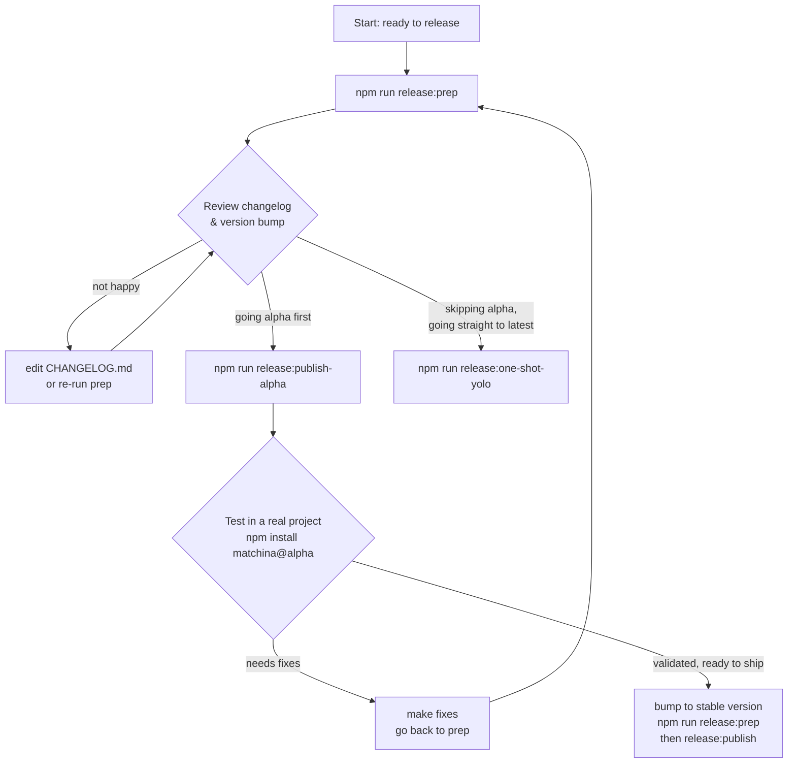

# Release Workflow

## The Golden Rule

**You never publish without reviewing first.** `release:prep` always runs first. Everything else is gated behind a human checkpoint.

## Workflow



## Scripts

### `release:prep`
```
npm run test && changelogen --release
```
Runs tests, bumps version in `package.json`, writes `CHANGELOG.md`. **Nothing is published. Nothing is pushed.** Review the diff before proceeding.

### `release:publish-alpha`
```
npm run build:lib && npm publish --tag alpha
```
Publishes the current version to npm under the `alpha` dist-tag. `npm install matchina` still gets the previous `latest`. Only `npm install matchina@alpha` gets this version.

### `release:publish`
```
npm run build:lib && npm publish && git push --follow-tags
```
Publishes the current version to npm and sets it as `latest` automatically. Also pushes the version commit and git tag. This is what makes `npm install matchina` return the new version.

### `release:one-shot-yolo`
```
npm run release:prep && npm run release:publish
```
Prep + publish in one shot, straight to `latest`. Only use when you have full confidence and don't need an alpha validation step. Named accordingly.

## Typical alpha release sequence

```
npm run release:prep           # test + bump + changelog
# review the diff
npm run release:publish-alpha  # publish as @alpha, doesn't touch latest
# npm install matchina@alpha in a real test project, kick the tires
# fix anything broken, re-run prep if needed
# once validated, run release:prep again to bump to stable (e.g. 0.2.0)
npm run release:publish        # publish stable, sets latest, pushes tags
```

## npm dist-tags explained

| tag | what it means | how to install |
|-----|--------------|----------------|
| `latest` | what users get by default | `npm install matchina` |
| `alpha` | prerelease, opt-in only | `npm install matchina@alpha` |

`npm publish` sets `latest` automatically. `--tag alpha` overrides that, publishing the version without touching `latest`. Alpha versions never become `latest` directly — always cut a clean stable version first.
