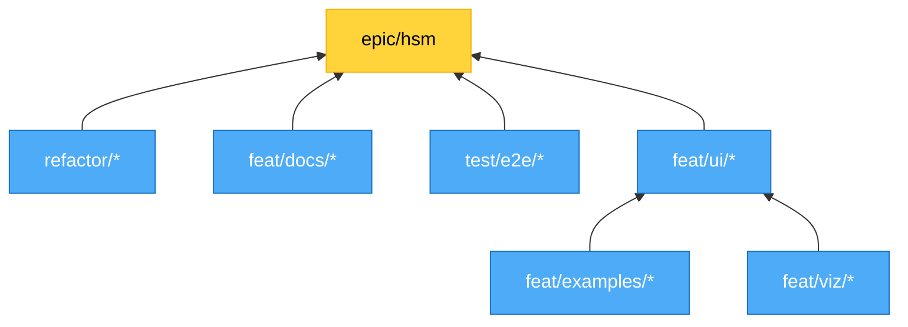

# Branch Plan - V2 HSM Epic

**Branch:** `feat/hsm-dual-mode-with-viz-and-examples`
**Beads Epic:** matchina-18 (HSM Epic)
**Review Source:** matchina-20 (HSM Epic Review), `review/full-docs-with-live-examples-review-raw.md`

---

## Work Streams & Branch Organization

**Work Streams:**
- **Visualization:** `feat/viz/*` or `refactor/viz/*`
- **Documentation & Examples:** `feat/docs/*`, `feat/examples/*`
- **Refactoring:** `refactor/*` (or `refactor/viz/*`, `refactor/examples/*`, etc.)
- **UI/Styling/Cosmetic:** `feat/ui/*`, `style/*`
- **E2E Testing:** `test/e2e/*`

**Examples:**
- `feat/viz/react-flow-layout`
- `feat/ui/button-positioning`
- `refactor/viz/shape-store`
- `test/e2e/interactives`
- `feat/docs/state-guidelines`
- `feat/examples/traffic-light-refactor`

---

## Branch Dependency Graph

---

## High-Level Structure

### V2 Breaking Release (label: `v2`)
Main driver: Hierarchical State Machines (HSM)

**Top-Level Epics:**
- **HSM Epic** (matchina-18) - Core HSM functionality, examples, visualization, docs
- **Branch Plan Epic** (matchina-19) - Coordination and planning
- **HSM Epic Review** (matchina-20) - Review and validation (blocked by HSM Epic)

**Cross-Cutting Dimensions:**
- Documentation (MDX pages, tutorials, guidelines)
- Live examples (React components, interactive demos)
- Visualization (multiple visualizer improvements)
- Testing (unit tests, coverage, e2e)
- Code quality (type safety, refactoring)

---

## Priority Tiers

**P0/P1 (Critical/High) - Create Beads tickets:**
- API Naming & Structure
- HSM Core Refactor
- Traffic Light Example refactor
- Combo Box Example refactor
- Checkout Example refactor
- Existing issues: matchina-12, 13, 14, 15

**P2 (Medium) - Consider for tickets:**
- File Organization (nesting → hsm)
- Visualization improvements
- Documentation & Guidelines

**P3/P4 (Low/Backlog) - Leave in this doc:**
- Minor UI polish (button positioning, layout tweaks)
- Optional visualizer features (transparent backgrounds, etc.)
- E2E test clarification
- Shared UI components exploration

---

## Work Breakdown by Area

### 1. HSM Core Implementation

**API/Naming Issues:**
- `createDeclarativeFlatMachine` → needs better name (describeHSM? defineHSM?)
- `createHierarchicalMachine` → `makeHierarchical`? Should be hook/effect pattern
- `withParentTransitionFallback` → could use `setup()` pattern
- Parent transition fallback → cascade instead of traversing all ancestors

**Code Quality (src/nesting/):**
- [ ] matchina-12: shape-store low coverage (14.28%) - should use store machine
- [ ] matchina-13: parent-transition-fallback coverage (74.07%) - missing lines 59-76
- [ ] matchina-14: flattened-child-exit coverage (93.1%) - missing lines 58,77
- [ ] matchina-15: Cardinal Rule violations - transitions as variables break type safety
- Hierarchical structure shouldn't require `data: undefined` - use schema/default
- Remove empty closures → use `undefined`
- Fix type safety - remove `any` casts in declarative-flat.ts
- propagate-submachines.ts - 400 lines, needs iteration/cleanup
- shape-builders.ts - needs review
- shape-controller.ts - describes a store (consolidate?)

**File Organization:**
- Rename `src/nesting/` → `src/hsm/`?
- Move shape-related files? (unclear placement)
- Test file: `test/flat-machine.mjs` in random place

---

### 2. HSM Examples

#### Traffic Light (docs/src/code/examples/hsm-traffic-light/)

**Machine Issues:**
- Remove empty closures, use `undefined`
- Inline light cycle states/controller states where appropriate
- Machine definition is clean overall (keep this)

**View Issues:**
- Remove dependency on `parseFlatStateKey`
- Light UI conditionals should use `.match()`
- Button layout - too much movement, should be driven by available actions
- Controller state positioning (top) vs internal state (bottom) - rethink layout
- Buttons should stay fixed position (minimal layout shift)

**Visualization:**
- Flattened HSM diagram shows weird extra state (working.red vs working_red)

#### Combo Box (docs/src/code/examples/hsm-combo-box/)

**Missing Features:**
- Tag deletion (X button, backspace key)

**Machine Refactoring:**
- Move to stores: selected tags, suggestions, highlighted index
- Remove ID parameter ('active') - unclear purpose
- `handleTyped` → custom resolve hook
- Externalize available tags list
- Lift `typed` transition to active-level
- Simplify effect filtering (key prefix pattern)

**View Cleanup:**
- Remove `dummyStateFactory`
- Reduce variables
- Machines should create their own event APIs (not inline)
- Use direct action references (not optional `actions.focus?`)
- Remove state checks in handlers (machine ignores invalid transitions)
- Flat version is 20 lines longer - should match nested length after refactor

#### Checkout (docs/src/code/examples/hsm-checkout/)

**UI Issues:**
- Wizard UI overflows in docs (too narrow) - needs responsive layout
- Payment flow stuck in `authorizing` - needs simulation controls
- Add approve/deny/challenge controls for payment flow
- Show available actions in UI

**Machine Issues:**
- Redundant transitions? (payment back/exit vs shipping)
- Inline checkout states where appropriate
- Fix `getPaymentFromState` - don't cast `ev` to `any`
- Payment actions typing should work (remove casts)
- Tighten optional action references

**View Issues:**
- Step index mapping could get out of sync with states
- Payment section conditional extraction is cumbersome
- Dynamic event API (should be in machine)

---

### 3. Visualization System

**General Issues:**
- Group nodes need partially transparent backgrounds
- Transitions on exiting/entering nodes would be helpful
- Need visual distinction between UI area and visualizer area
- Zoom defaults - dynamically set to contain contents

**React Flow Visualizer:**
- Good UI, bad layout
- Node spreading too far (forcecraft)
- Light mode color scheme needs work (contrast)

**Sketch Visualizer:**
- UI design improving but colors still funky
- Need refinement

**Mermaid Visualizer:**
- Bold edge labels get clipped
- Transitions should be clickable (like before)
- Flatten multi-level picker to top-level options
- Remove useless "interactive" button

**Other:**
- Advanced fetcher demo - too many panels, diagram too small
- Line counts on code tabs - useful, keep

---

### 4. Documentation & Guidelines

**Missing Documentation:**
- Guidelines for creating states (common pitfalls)
- Guidelines for designing transitions
- When to inline vs extract state definitions
- Cardinal rule about not defining transitions as variables
- Store vs state for shared context
- Effect patterns and best practices

**File Organization:**
- Review inspectors/ folder (FooBarDemo - what is this?)
- Consolidate/document different inspectors and visualizers
- Clean up content/docs disconnected files
- Test file placement review

**Example Structure:**
- Unify traffic light example styles (multiple versions)
- Consider shared UI components (ui.tsx for common elements)
- Example code should follow cardinal rules

---

### 5. Code Quality & Type Safety

**Type Safety:**
- Fix `any` casts in examples (payment actions, event handlers)
- declarative-flat.ts - runtime keys/transitions losing strong typing?
- Optional action references should be tight typed references

**Patterns:**
- Use `.match()` for conditionals where appropriate
- Use `setup()` for hook composition
- Use stores for shared context (not threading through state)
- Event APIs should be created by machines, not inline in views
- Available actions pattern - make reusable

**Testing:**
- E2E stuff is more review than test (clarify purpose)
- Visual regression tests for state diagrams?
- Coverage gaps (12, 13, 14)

---

## Dependencies & Sequencing

**Must happen first:**
- matchina-12, 13, 14, 15 (existing code quality issues)
- API naming decisions (affects examples)
- File organization (`nesting/` → `hsm/`)

**Can happen in parallel:**
- Example refactoring (traffic light, combo box, checkout are independent)
- Visualization improvements (different visualizers)
- Documentation writing

**Depends on examples:**
- Documentation/guidelines (learn from fixing examples)
- Visual distinction patterns (once examples are clean)

---

## Open Questions

1. **API Naming:** What should `createDeclarativeFlatMachine` be called?
2. **Store Pattern:** Standardize when to use stores vs state for context?
3. **Shape Placement:** Where should shape-related code live?
4. **Nesting → HSM:** Rename directory and related naming?
5. **Lazy Shape Store:** Is this pattern needed or simplify?
6. **Git Strategy:** Try git-town for stacked branches?
7. **Merge Timing:** When to merge to main? All at once or incremental PRs?

---

## Work Streams / Branches

**Stream 1: Foundation (Sequential)**
- Branch: `feat/hsm-api-naming` or work in main branch
- Work: API Naming decisions + Core refactoring
- Blocks: All example work

**Stream 2: Examples (Parallel after Stream 1)**
- Branch: `feat/hsm-traffic-light-refactor`
- Branch: `feat/hsm-combo-box-refactor`
- Branch: `feat/hsm-checkout-refactor`
- Can work independently after API is settled

**Stream 3: Quality & Organization (Parallel)**
- Branch: Could be individual branches or batched
- Work: matchina-12, 13, 14, 15 + file organization
- Can work independently of examples

**Stream 4: Documentation (Depends on Examples)**
- Branch: `feat/hsm-docs-guidelines`
- Work: Guidelines, patterns, tutorials
- Needs examples to be clean first

**Stream 5: Visualization (Parallel, Optional)**
- Branch: `feat/viz-improvements`
- Work: Visualizer improvements (P2, lower priority)
- Can work independently

**Git Strategy:**
- Consider git-town for stacked branches
- Potential for incremental PRs vs single large merge
- TBD: Merge timing to main

---

*This document will be moved into Beads ticket descriptions and deleted once work breakdown is complete.*
