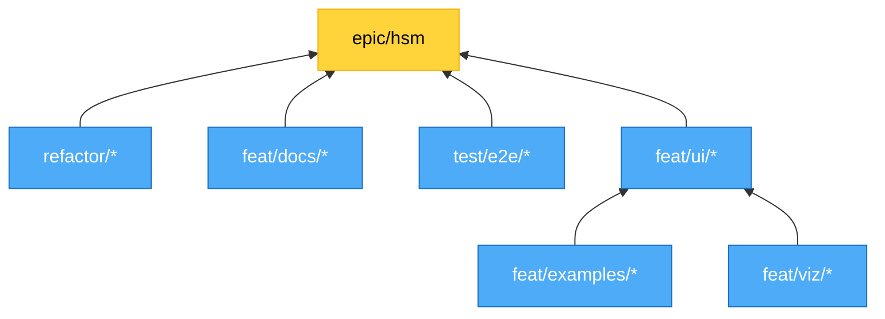

# Branch Plan - V2 HSM Epic

**Epic:** matchina-18 | **Branch:** `feat/hsm-dual-mode-with-viz-and-examples` | **Review:** matchina-20

---

## Overview

Branch planning for V2 HSM release. Focus: **Interactive documentation** - full-stack e2e validation of library + examples + docs.

**Audience:** Senior engineers, AI agents. Assumes expertise.

**Usage:**
- Reference for branch naming, dependencies, work streams
- Update as work evolves, delete when tickets created
- Code quality at dev discretion unless explicitly stated
- No work below branch grain

---

## Branch Dependency Graph

## Work Streams

### `feat/examples/*`
**Deps:** API naming
**Primary:** Traffic Light refactor
**Done:** Combo Box, Checkout

### `feat/viz/*`
**Deps:** None
**Focus:** Interactive visualizers for docs
**Details:** See matchina-20

### `feat/ui/*`
**Deps:** examples, viz
**Focus:** Interactive patterns, polish
**Details:** See matchina-20

### `test/e2e/*`
**Deps:** ui
**Focus:** Full-stack interactive validation (library + examples + docs)

### `feat/docs/*`
**Deps:** None
**Status:** Guidelines merged

### `refactor/*`
**Deps:** None
**As needed:** matchina-12, 13, 14, 15
**API naming TBD**

---

## Open Questions

- API naming for declarative flat machines
- Git-town for stacked branches
- Merge strategy

---

*Delete when ticketed. Review: matchina-20*
