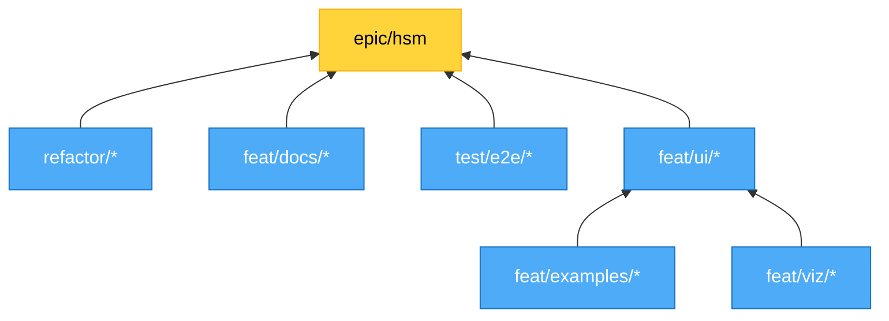

# Branch Plan

## Branch Dependency Graph

---

## Overview

**Audience:** Repo owners, agents. Principal-level, fully hands-on. No hand-holding. True conflicts must be hashed out.

**Focus:** Interactive documentation - full-stack e2e validation of library + examples + docs.

**Active Epics:**
- [matchina-18: HSM Epic](http://localhost:3000/#/board?issue=matchina-18) - V2 breaking release
- Branch: [feat/hsm-dual-mode-with-viz-and-examples](https://github.com/WinstonFassett/matchina/tree/feat/hsm-dual-mode-with-viz-and-examples)
- Review: [matchina-20: HSM Epic Review](http://localhost:3000/#/board?issue=matchina-20)

**STATUS:** All P2 coverage investigations completed. Ready to focus on P1 HSM Epic work.

---

## Instructions

**Method:**
- Add actual live branches to diagram when created
- Remove branches from diagram when closed/merged
- Update work streams as work evolves
- Delete this doc when work is fully ticketed

**Links:**
- Board links use `bd` issue IDs (accessible via CLI: `bd show matchina-XX`)
- Run `bdui` for web interface at `http://localhost:3000`
- Branch links point to GitHub

**COMPLETED:**
- [x] All P2 coverage investigations completed
- [x] Cardinal Rule violations fixed
- [x] Review findings moved to tickets (matchina-21, 22, 23, 24)

**TODO:**
- [ ] Create ticket: Setup git-town for stacked branches
- [ ] Create ticket: Open questions (low priority)

---

## Work Streams

### `feat/examples/*`
**Deps:** API naming
**Primary:** Traffic Light refactor
**Done:** Combo Box, Checkout

### `feat/viz/*`
**Deps:** None
**Focus:** Interactive visualizers for docs
**Status:** Issues identified in matchina-21

### `feat/ui/*`
**Deps:** examples, viz
**Focus:** Interactive patterns, polish

### `test/e2e/*`
**Deps:** ui
**Focus:** Full-stack interactive validation (library + examples + docs)

### `feat/docs/*`
**Deps:** None
**Status:** Guidelines merged

### `refactor/*`
**Deps:** None
**Focus:** API naming, file organization

---

*Delete when ticketed.*
