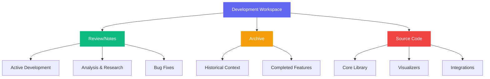

# Development Workspace Organization Guide

## 🚀 Quick Start

```bash
# Start development server
npm run review

# Update file dates for proper sorting
npm run dates-dry  # Preview changes
npm run dates      # Apply updates
```

## 🎯 Current Setup Features

### ✅ Auto-Generated Sidebar
- **Zero maintenance** - Automatically scans file structure
- **Date-based sorting** - Most recent files first (requires date metadata)
- **Smart title formatting** - Converts filenames to readable titles
- **Git-aware** - Uses git dates when tracked, filesystem dates when not

### ✅ Rich Content Support
- **Mermaid diagrams** - Interactive diagrams from code blocks
- **Image embedding** - Direct image references work
- **Cross-linking** - Link between any files in the project
- **Dark/Light themes** - Automatic theme switching

## 📝 Content Examples

### Mermaid Diagram Example



### Image Embedding Example

#### Screenshot from Development


#### Multiple Screenshots
| Dark Theme | Light Theme |
|------------|-------------|
|  |  |

### Cross-Reference Example
- **Source Code**: See [atom.ts implementation](../src/atom.ts)
- **Related Analysis**: [Mermaid CSS Architecture](./Mermaid CSS Architecture Analysis.md)
- **Archive Reference**: [Previous design discussion](./archive/20251230-Design Review and Sanity Check.md)

## 🗂️ Naming Convention Discussion

### Current: `review/` vs Proposed Options

| Option | Pros | Cons | Recommendation |
|--------|-------|-------|----------------|
| `review/` | ✅ Established<br>✅ Clear purpose | ❌ Sounds formal<br>❌ Implies peer review | Keep for now |
| `notes/` | ✅ Casual<br>✅ Living documents | ❌ Too generic<br>❌ Might confuse with meeting notes | Good alternative |
| `dev-notes/` | ✅ Clear purpose<br>✅ Distinguishes from docs | ❌ Longer<br>❌ Hyphenated | Strong contender |
| `scratch/` | ✅ Temporary feel<br>✅ Experimental | ❌ Too temporary<br>❌ Might imply throwaway | Not ideal |
| `workspace/` | ✅ Professional<br>✅ Clear purpose | ❌ Generic<br>❌ Might confuse with project root | Too broad |

### 🎯 Recommendation: **`notes/`**

**Why `notes/` works best:**
- **Simple and natural** - "Development notes" is intuitive
- **Casual feel** - Living, evolving content
- **Distinguishes** - Separate from `docs/` directory
- **Professional** - Suitable for serious development work

## 📋 Migration Plan

### Phase 1: Date Metadata Setup
- [ ] Run `npm run dates-dry` to preview changes
- [ ] Run `npm run dates` to apply date metadata to all files
- [ ] Verify VitePress sidebar sorts by recency (newest first)
- [ ] Commit date metadata changes

### Phase 2: File Naming Convention
- [ ] Rename ALL_CAPS files to Title Case or snake_case
- [ ] Update internal links in affected files
- [ ] Test VitePress sidebar generation and title formatting
- [ ] Verify all links work correctly
- [ ] Commit file naming changes

### Phase 3: Directory Rename (Future)
- [ ] Rename `review/` → `notes/`
- [ ] Update npm scripts paths (`dates` and `dates-dry`)
- [ ] Test all links and images work after rename
- [ ] Verify VitePress still serves correctly
- [ ] Commit directory rename changes

### Phase 4: Content Migration (Future Consideration)
- [ ] Review files suitable for `docs/` migration
- [ ] Move user-facing docs to official documentation
- [ ] Keep development-specific content in `notes/`
- [ ] Update cross-references

---

*This document serves as both a demonstration and a planning guide for organizing our development workspace.*
