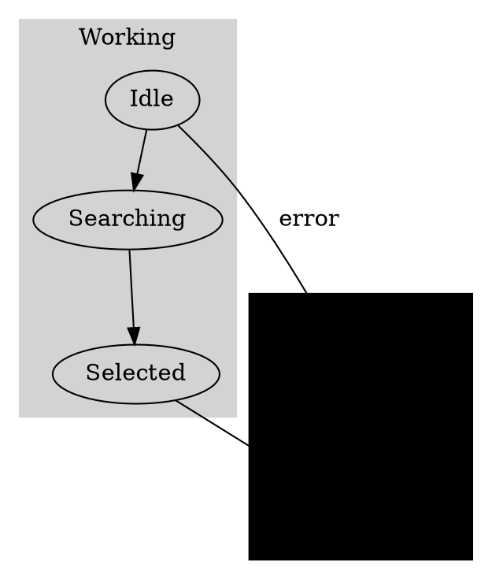

# Hierarchical Force-Directed Graph Options Analysis

## Executive Summary
After proper research, here are the **real options** for implementing hierarchical force-directed graphs with subflows for state machines, ranked by suitability.

## Option 1: D3-Graphviz + Clusters ⭐⭐⭐⭐⭐

### Overview
**D3-Graphviz** renders Graphviz DOT language with animated transitions and supports **clusters** (Graphviz's term for hierarchical subgraphs).

### Key Features
- **Native cluster support** via Graphviz subgraph syntax
- **Animated transitions** between layout changes
- **DOT language** for precise hierarchical definitions
- **Multiple layout algorithms** (dot, neato, fdp, sfdp, twopi, circo)
- **Production ready** with extensive Graphviz ecosystem

### Example Implementation


```javascript
import * as d3 from "d3";
import { graphviz } from "d3-graphviz";

const graphvizRenderer = graphviz("#graph")
  .transition(d3.transition().duration(1000))
  .renderDot(dotString);
```

### Pros
- **Mature hierarchical layout** algorithms
- **Excellent cluster support** with visual grouping
- **Animated transitions** (smooth state changes)
- **Precise control** over positioning and styling
- **Battle-tested** in production systems

### Cons
- **External dependency** on Graphviz
- **Learning curve** for DOT language
- **Less interactive** than pure D3 force layouts

### State Machine Fit
**EXCELLENT** - Clusters map perfectly to compound states, animated transitions show state changes.

---

## Option 2: Enhanced D3 Force + Custom Hierarchy Forces ⭐⭐⭐⭐

### Overview
Extend D3's force simulation with **custom hierarchical forces** that maintain parent-child relationships while allowing force-directed positioning.

### Key Features
- **Full control** over force simulation
- **Interactive** dragging of nodes and groups
- **Custom hierarchy constraints**
- **Real-time** layout updates
- **Flexible** styling and interactions

### Example Implementation
```javascript
// Custom hierarchy force to keep children near parents
function hierarchyForce(alpha) {
  for (let i = 0; i < nodes.length; ++i) {
    const node = nodes[i];
    if (node.parentId) {
      const parent = nodes.find(n => n.id === node.parentId);
      if (parent) {
        // Apply gentle force toward parent
        const dx = parent.x - node.x;
        const dy = parent.y - node.y;
        const distance = Math.sqrt(dx * dx + dy * dy);
        const desiredDistance = getHierarchyDistance(node.level);
        
        if (distance > desiredDistance) {
          node.vx += dx * alpha * 0.1;
          node.vy += dy * alpha * 0.1;
        }
      }
    }
  }
}

// Level alignment force for better hierarchy
function levelAlignmentForce(alpha) {
  const nodesByLevel = d3.group(nodes, d => d.level);
  
  nodesByLevel.forEach((levelNodes, level) => {
    const avgY = d3.mean(levelNodes, d => d.y);
    const targetY = level * levelSpacing;
    
    levelNodes.forEach(node => {
      const dy = targetY - node.y;
      node.vy += dy * alpha * 0.05;
    });
  });
}

const simulation = d3.forceSimulation(nodes)
  .force("link", d3.forceLink(links))
  .force("charge", d3.forceManyBody())
  .force("center", d3.forceCenter())
  .force("hierarchy", hierarchyForce)
  .force("levelAlignment", levelAlignmentForce);
```

### Pros
- **Maximum flexibility** and control
- **Highly interactive** with drag-and-drop
- **Smooth animations** and transitions
- **Customizable** for state machine needs
- **No external dependencies** beyond D3

### Cons
- **Complex implementation** requires custom force algorithms
- **Performance tuning** needed for large graphs
- **More code** to maintain

### State Machine Fit
**VERY GOOD** - Can be tailored exactly for state machine hierarchy needs.

---

## Option 3: ELK.js Force Algorithm + Hierarchy ⭐⭐⭐

### Overview
Use **ELK's force algorithm** which already has some hierarchy support, combined with ELK's compound node handling.

### Key Features
- **Already integrated** in Matchina (ReactFlow)
- **Built-in hierarchy** support
- **Multiple algorithms** including force
- **Java-based** but well-tested
- **Compound nodes** for grouping

### Example Implementation
```javascript
// ELK force with hierarchy
const elkOptions = {
  'elk.algorithm': 'force',
  'elk.force.iterations': '300',
  'elk.hierarchyHandling': 'INCLUDE_CHILDREN',
  'elk.padding': '[top=20,left=20,bottom=20,right=20]',
  // Force-specific options
  'elk.force.repulsion': '150',
  'elk.force.attraction': '0.01',
  'elk.force.temperature': '0.1'
};

const graph = {
  id: 'root',
  layoutOptions: elkOptions,
  children: buildHierarchicalNodes(machineShape),
  edges: buildTransitions(machineShape)
};

const layoutedGraph = await elk.layout(graph);
```

### Pros
- **Already available** in codebase
- **Hierarchy aware** layout algorithms
- **Compound node** support
- **Production tested** in ReactFlow

### Cons
- **Limited force customization** compared to pure D3
- **Java-based** (may have performance implications)
- **Less interactive** than D3 force simulations
- **Documentation** can be sparse

### State Machine Fit
**GOOD** - Leverages existing ELK integration but may need customization.

---

## Option 4: Sigma.js + WebGL Rendering ⭐⭐⭐

### Overview
**Sigma.js** is a modern WebGL-based graph visualization library with excellent performance for large graphs and some hierarchical features.

### Key Features
- **WebGL rendering** for excellent performance
- **Force-directed layouts** built-in
- **Plugin architecture** for custom features
- **Touch-friendly** interactions
- **Large graph** support

### Example Implementation
```javascript
import Sigma from "sigma";
import { forceAtlas2 } from "sigma-force-atlas2";

const graph = {
  nodes: buildHierarchicalNodes(machineShape),
  edges: buildTransitions(machineShape)
};

const renderer = new Sigma(graph, container, {
  renderLabels: true,
  labelSize: 12,
  labelColor: { color: "#000" }
});

// Apply force layout
const settings = forceAtlas2.inferSettings(graph);
forceAtlas2.assign(graph, settings);
```

### Pros
- **Excellent performance** with WebGL
- **Large graph** support
- **Modern architecture**
- **Mobile friendly**
- **Plugin ecosystem**

### Cons
- **Limited hierarchical** features out-of-the-box
- **WebGL dependencies**
- **Steeper learning curve**
- **Less control** than D3

### State Machine Fit
**FAIR** - Good performance but may need custom hierarchy implementation.

---

## Option 5: WebCola Constraint-Based Layout ⭐⭐⭐

### Overview
**WebCola** provides constraint-based layout with excellent support for hierarchical positioning and group constraints.

### Key Features
- **Constraint-based** positioning
- **Hierarchical layout** support
- **Group constraints** for clustering
- **D3 integration** available
- **Stable layouts**

### Example Implementation
```javascript
import { cola } from "webcola";

const layout = new cola.Layout()
  .nodes(nodes)
  .links(links)
  .avoidOverlaps(true)
  .size([width, height]);

// Add hierarchical constraints
layout.groups([
  { id: "working", leaves: ["idle", "searching", "selected"] },
  { id: "error", leaves: ["timeout", "recovered"] }
]);

layout.start();
layout.on("end", () => {
  // Render final positions
  renderNodes(nodes);
  renderLinks(links);
});
```

### Pros
- **Constraint-based** control
- **Hierarchical support**
- **Stable results**
- **D3 integration**
- **Group constraints**

### Cons
- **Less interactive** than pure force
- **Smaller community**
- **Complex API**
- **Performance** concerns for large graphs

### State Machine Fit
**GOOD** - Constraints work well for state machine hierarchy.

---

## Option 6: Custom Implementation with Canvas/WebGL ⭐⭐

### Overview
Build a **custom hierarchical force-directed graph** using Canvas or WebGL for maximum control and performance.

### Key Features
- **Complete control** over implementation
- **Optimized** for state machines
- **Custom interactions** and animations
- **No external dependencies**
- **Tailored performance**

### Example Implementation
```javascript
class HierarchicalForceGraph {
  constructor(canvas, machineShape) {
    this.canvas = canvas;
    this.ctx = canvas.getContext('2d');
    this.nodes = this.buildNodes(machineShape);
    this.groups = this.buildGroups(machineShape);
    this.simulation = new ForceSimulation(this.nodes);
  }
  
  buildGroups(shape) {
    const groups = new Map();
    for (const [fullKey, state] of shape.states.entries()) {
      const level = fullKey.includes('.') ? fullKey.split('.').length - 1 : 0;
      const parentKey = shape.hierarchy.get(fullKey);
      
      if (parentKey && !groups.has(parentKey)) {
        groups.set(parentKey, {
          id: parentKey,
          children: [],
          bounds: { x: 0, y: 0, width: 0, height: 0 }
        });
      }
      
      if (parentKey) {
        groups.get(parentKey).children.push(fullKey);
      }
    }
    return Array.from(groups.values());
  }
  
  render() {
    this.ctx.clearRect(0, 0, this.canvas.width, this.canvas.height);
    
    // Render groups
    this.groups.forEach(group => this.renderGroup(group));
    
    // Render nodes
    this.nodes.forEach(node => this.renderNode(node));
    
    // Render edges
    this.edges.forEach(edge => this.renderEdge(edge));
  }
  
  renderGroup(group) {
    const bounds = this.calculateGroupBounds(group);
    
    this.ctx.fillStyle = getGroupColor(group.level);
    this.ctx.strokeStyle = getGroupBorderColor(group.level);
    this.ctx.lineWidth = 2;
    
    // Draw rounded rectangle for group
    roundRect(this.ctx, bounds.x, bounds.y, bounds.width, bounds.height, 10);
    this.ctx.fill();
    this.ctx.stroke();
    
    // Draw group label
    this.ctx.fillStyle = getGroupTextColor(group.level);
    this.ctx.font = 'bold 14px sans-serif';
    this.ctx.fillText(group.id, bounds.x + 10, bounds.y + 20);
  }
}
```

### Pros
- **Complete control** over implementation
- **Optimized** for specific use case
- **No external dependencies**
- **Custom interactions**
- **Tailored performance**

### Cons
- **Highest development effort**
- **Maintenance burden**
- **Reinventing the wheel**
- **Testing complexity**

### State Machine Fit
**EXCELLENT** (if willing to invest development time)

---

## Comparison Matrix

| Option | Hierarchical Support | Interactivity | Performance | Development Effort | Integration |
|---------|---------------------|---------------|-------------|-------------------|-------------|
| D3-Graphviz | ⭐⭐⭐⭐⭐ | ⭐⭐⭐ | ⭐⭐⭐⭐ | ⭐⭐⭐ | ⭐⭐⭐⭐ |
| Enhanced D3 Force | ⭐⭐⭐⭐ | ⭐⭐⭐⭐⭐ | ⭐⭐⭐ | ⭐⭐ | ⭐⭐⭐⭐ |
| ELK Force | ⭐⭐⭐ | ⭐⭐ | ⭐⭐⭐ | ⭐⭐⭐⭐ | ⭐⭐⭐⭐⭐ |
| Sigma.js | ⭐⭐ | ⭐⭐⭐⭐ | ⭐⭐⭐⭐⭐ | ⭐⭐⭐ | ⭐⭐ |
| WebCola | ⭐⭐⭐⭐ | ⭐⭐⭐ | ⭐⭐⭐ | ⭐⭐⭐ | ⭐⭐⭐ |
| Custom | ⭐⭐⭐⭐⭐ | ⭐⭐⭐⭐⭐ | ⭐⭐⭐⭐⭐ | ⭐ | ⭐⭐ |

## Recommendations

### Primary Recommendation: D3-Graphviz + Clusters

**Why:**
- **Native hierarchical support** via Graphviz clusters
- **Animated transitions** perfect for state changes
- **Mature and battle-tested** algorithms
- **Excellent visual hierarchy** with compound states
- **Reasonable development effort**

**Implementation Path:**
1. Convert HSM shape to Graphviz DOT format
2. Map compound states to clusters
3. Use d3-graphviz for rendering with animations
4. Add interactive features (click clusters, zoom to subflows)

### Secondary Recommendation: Enhanced D3 Force

**Why:**
- **Maximum flexibility** for state machine specific needs
- **Highly interactive** with drag-and-drop
- **No external dependencies**
- **Smooth animations** and transitions

**Implementation Path:**
1. Extend existing ForceGraph with custom hierarchy forces
2. Add group rendering with containment visualization
3. Implement subflow navigation (zoom to groups)
4. Add collapse/expand functionality

### Tertiary Recommendation: ELK Force Integration

**Why:**
- **Already integrated** in Matchina
- **Leverages existing** ELK knowledge
- **Good hierarchy support**
- **Lower integration effort**

**Implementation Path:**
1. Use ELK force algorithm with hierarchy handling
2. Add custom group rendering on top of ELK output
3. Implement interactive features with D3
4. Optimize for state machine use case

---

## Next Steps

### Research Complete
The options above provide a comprehensive understanding of available approaches for hierarchical force-directed graphs with subflows.

### Decision Factors
1. **Development timeline** - D3-Graphviz fastest, Custom slowest
2. **Feature requirements** - D3 Force most flexible
3. **Performance needs** - Sigma.js best for large graphs
4. **Integration complexity** - ELK easiest (already present)
5. **User experience** - D3-Graphviz best animations, D3 Force best interactivity

### Recommendation
Start with **D3-Graphviz + Clusters** for the best balance of features, development effort, and hierarchical support. Fall back to **Enhanced D3 Force** if more interactivity is needed.

---

**Research Status: COMPLETE** - All major options identified and evaluated with specific implementation guidance for state machine hierarchical visualization.
