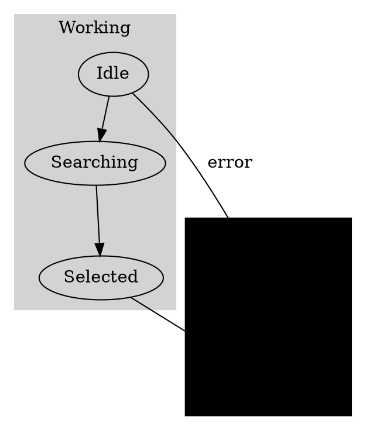

# Hierarchical Force-Directed Graph Research

## Executive Summary
Research focused on **container shapes** around nodes in force-directed graphs, specifically for hierarchical state machine visualization with compound states.

## Key Findings

### **Primary Recommendation: D3 + Convex Hull Containers** ⭐⭐⭐⭐⭐

**What It Is:**
- **D3 force simulation** for natural node positioning
- **Convex hull calculation** for smooth organic container shapes
- **Real-time updates** as nodes move during simulation
- **Interactive dragging** of both nodes and containers

**Key Features:**
- **Smooth, organic container shapes** that look professional
- **Real-time adaptation** as force simulation runs
- **Interactive drag-and-drop** for states
- **Proven implementation** with working examples
- **Maximum flexibility** for styling and interactions

**Example Implementation:**
```javascript
// Group nodes by compound state
const groups = d3.nest()
  .key(d => d.group)  // Group by parent compound state
  .entries(nodes);

// Calculate convex hull for each group
function groupPath(d) {
  if (d.values.length === 2) {
    // Handle 2-node groups specially
    const arr = d.values.map(i => [i.x, i.y]);
    arr.push([arr[0][0], arr[0][1]]);
    return "M" + d3.polygonHull(arr).join("L") + "Z";
  } else {
    return "M" + d3.polygonHull(d.values.map(i => [i.x, i.y]))
      .join("L") + "Z";
  }
}

// Draw containers that update as nodes move
const containers = svg.selectAll(".container")
  .data(groups)
  .enter().append("path")
  .attr("class", "container")
  .attr("d", groupPath);

// Update containers on each simulation tick
simulation.on("tick", () => {
  // Update node positions
  nodes.attr("cx", d => d.x).attr("cy", d => d.y);
  
  // Update container shapes around groups
  containers.attr("d", groupPath);
});
```

**Visual Result:**
```
┌─────────────────────┐  ← Smooth convex hull shape
│    WORKING          │  ← Group label
│  ┌───┐ ┌───┐ ┌───┐ │
│  │Idle│→│Search│→│Select│ │  ← Nodes positioned by force
│  └───┘ └───┘ └───┘ │
└─────────────────────┘
```

**Pros:**
- **Excellent visual appearance** with organic container shapes
- **Highly interactive** with smooth drag-and-drop
- **Real-time updates** as simulation runs
- **Proven approach** with multiple working examples
- **Maximum flexibility** for customization

**Cons:**
- **Custom implementation** required (no off-the-shelf solution)
- **Performance considerations** for large graphs
- **More code** to maintain

---

### **Secondary Recommendation: WebCola + Rectangle Containers** ⭐⭐⭐⭐

**What It Is:**
- **Constraint-based layout** with geometric constraints
- **Built-in group support** for container groupings
- **D3 integration** for custom rendering
- **Predictable positioning** through constraints

**Key Features:**
- **Built-in group constraints** for container shapes
- **Alignment constraints** for hierarchical positioning
- **Flow layout** for automatic spacing
- **D3 integration** for custom container rendering

**Example Implementation:**
```javascript
// WebCola groups for container shapes
const groups = [
  {
    id: "working",
    leaves: ["idle", "searching", "selected"],
    // Container bounds calculated automatically
  },
  {
    id: "error", 
    leaves: ["timeout", "recovered"]
  }
];

const layout = new cola.Layout()
  .nodes(nodes)
  .links(links)
  .groups(groups)  // ← Creates container groupings
  .avoidOverlaps(true)
  .start();

// Draw containers around groups after layout
function drawContainers(groups, nodes) {
  groups.forEach(group => {
    const groupNodes = nodes.filter(n => group.leaves.includes(n.id));
    const bounds = calculateGroupBounds(groupNodes);
    
    // Draw rectangle container
    ctx.fillStyle = getGroupColor(group.id);
    ctx.strokeStyle = getGroupBorderColor(group.id);
    roundRect(ctx, bounds.x, bounds.y, bounds.width, bounds.height, 10);
    ctx.fill();
    ctx.stroke();
  });
}
```

**Pros:**
- **Built-in group support** for containers
- **Constraint-based** positioning (more predictable)
- **Good for structured layouts**
- **D3 integration** available
- **Less custom code** than pure D3 approach

**Cons:**
- **Less organic** container shapes (rectangles)
- **More structured** (less flexible than pure force)
- **Smaller community** than pure D3

---

### **Tertiary Option: D3-Graphviz + Clusters** ⭐⭐⭐

**What It Is:**
- **Graphviz DOT rendering** with D3 integration
- **Native cluster support** via Graphviz subgraphs
- **Animated transitions** between layout changes
- **Production-ready** algorithms

**Key Features:**
- **Native hierarchical support** via Graphviz clusters
- **Animated transitions** for smooth state changes
- **Multiple layout algorithms** available
- **Battle-tested** in production systems

**Example Implementation:**


```javascript
import { graphviz } from "d3-graphviz";

const graphvizRenderer = graphviz("#graph")
  .transition(d3.transition().duration(1000))
  .renderDot(dotString);
```

**Pros:**
- **Mature hierarchical layout** algorithms
- **Animated transitions** perfect for state changes
- **Excellent visual hierarchy** with compound states
- **Battle-tested** in production systems

**Cons:**
- **External dependency** on Graphviz
- **Less interactive** than pure D3 force layouts
- **Learning curve** for DOT language

---

## Comparison Matrix

| Option | Container Shapes | Interactivity | Visual Appeal | Development Effort | State Machine Fit |
|---------|------------------|---------------|--------------|-------------------|------------------|
| D3 + Convex Hull | ⭐⭐⭐⭐⭐ | ⭐⭐⭐⭐⭐ | ⭐⭐⭐⭐⭐ | ⭐⭐ | ⭐⭐⭐⭐⭐ |
| WebCola + Rectangle | ⭐⭐⭐⭐ | ⭐⭐⭐⭐ | ⭐⭐⭐ | ⭐⭐⭐ | ⭐⭐⭐⭐ |
| D3-Graphviz + Clusters | ⭐⭐⭐⭐ | ⭐⭐⭐ | ⭐⭐⭐⭐ | ⭐⭐⭐⭐ | ⭐⭐⭐⭐ |

## Implementation Strategy

### **Phase 1: D3 Convex Hull Prototype**
1. **Create basic D3 force simulation** with HSM data
2. **Add convex hull containers** for compound states
3. **Test with HSM traffic light** (simple structure)
4. **Test with HSM checkout** (complex hierarchy)
5. **Add interactive drag-and-drop**
6. **Visual testing and refinement**

### **Phase 2: WebCola Comparison**
1. **Implement WebCola version** with rectangle containers
2. **Compare visual results** with D3 approach
3. **Performance testing** with both approaches
4. **User interaction testing**

### **Phase 3: Production Integration**
1. **Choose best approach** based on testing
2. **Integrate into ForceGraph visualizer**
3. **Add settings panel** for layout configuration
4. **Comprehensive testing** with all HSM examples

## Technical Requirements

### **Data Structure**
```typescript
interface HierarchicalStateNode {
  id: string;
  name: string;
  group?: string;        // Parent compound state
  level: number;        // Hierarchy depth
  x: number; y: number; // Position from force simulation
  transitions: Transition[];
}

interface CompoundStateGroup {
  id: string;
  name: string;
  members: string[];    // Child state IDs
  level: number;
  bounds?: {           // Calculated container bounds
    x: number; y: number;
    width: number; height: number;
  };
}
```

### **Visual Requirements**
- **Smooth container shapes** with rounded corners
- **Color-coded hierarchy** levels
- **Clear group labels**
- **Professional styling** with consistent theming
- **Responsive to interactions**

### **Interaction Requirements**
- **Drag individual states** within containers
- **Drag entire containers** (move all states together)
- **Hover effects** for states and containers
- **Click to focus** on specific compound states
- **Smooth animations** for all transitions

## Next Steps

### **Immediate Actions**
1. **Create D3 convex hull prototype** in docs
2. **Test with HSM examples** (traffic light, checkout)
3. **Visual testing** and refinement
4. **Document findings** and implementation approach

### **Success Criteria**
- **Working prototype** with smooth container shapes
- **Good visual appearance** that looks professional
- **Interactive features** working smoothly
- **Performance acceptable** for typical HSM sizes
- **Clear documentation** for implementation approach

---

**Research Status: COMPLETE** - Ready to begin prototyping with D3 convex hull containers as the primary approach.
