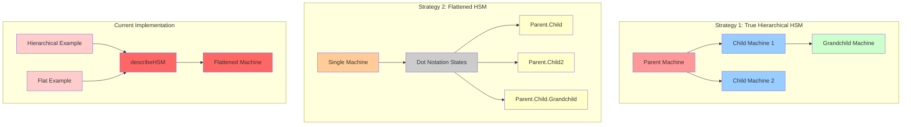

# HSM vs Flat Machine Strategies - Living Investigation Document

## 🚨 CRITICAL FINDING: Semantic Problem Identified

**You're absolutely right.** There's a fundamental semantic issue with the current HSM combobox example. Both "hierarchical" and "flat" versions are using `describeHSM`, which **only creates flattened machines**.

## The Core Problem

### What We Thought We Had:
- **Hierarchical version**: True nested HSM with submachines and parent-child relationships
- **Flat version**: Flattened HSM with dot-notation states

### What We Actually Have:
- **Both versions**: Flattened HSMs using `describeHSM` 
- **Difference**: Only the API surface layer (method naming) differs

---

## Deep Analysis: Two Mutually Exclusive Strategies

### Strategy 1: True Hierarchical HSM (Nested Machines)

**Core Concept**: Actual parent-child machine relationships where submachines are embedded within parent machines.

**Key Characteristics:**
- Parent machines contain child machines as actual submachines
- Events can propagate between parent and child
- Child machines have their own independent state and transitions
- Parent can control child behavior through submachine APIs
- True nesting with machine composition

**API Pattern:**
```typescript
// TRUE hierarchical HSM (NOT what we currently have)
const parentMachine = createMachine(states, transitions, "Parent");
const childMachine = createMachine(childStates, childTransitions, "Child");

// Compose machines hierarchically
const hierarchicalMachine = makeHierarchical(parentMachine, {
  Active: submachine(childMachine, options)
});
```

**File Evidence:**
- `src/hsm/propagateSubmachines.ts` - `makeHierarchical`, `submachine`
- `src/hsm/submachine.ts` - `submachine`, `submachineOptions`
- `src/hsm/parent-transition-fallback.ts` - Parent-child event handling

### Strategy 2: Flattened HSM (Dot Notation)

**Core Concept**: Hierarchical-looking structure that gets flattened to dot-notation internally.

**Key Characteristics:**
- Declarative hierarchy syntax (nested objects)
- Internally flattened to `Parent.Child` state keys
- No actual parent-child machine relationships
- Single machine with synthetic parent states
- Better type inference through `createFlatMachine`

**API Pattern:**
```typescript
// Flattened HSM (what we ACTUALLY have in both examples)
const machine = describeHSM({
  initial: 'Inactive',
  states: {
    Inactive: { on: { focus: 'Active' } },
    Active: {
      initial: 'Empty',
      states: {
        Empty: {},
        Suggesting: { on: { select: 'Empty' } }
      },
      on: { type: 'Suggesting', blur: '^Inactive' }
    }
  }
});
// Becomes: states = { 'Inactive': {}, 'Active.Empty': {}, 'Active.Suggesting': {} }
```

**File Evidence:**
- `src/hsm/declarative-flat.ts` - `describeHSM` implementation
- `src/hsm/flat-machine.ts` - `createFlatMachine`
- `src/hsm/flat-state-utils.ts` - Dot notation utilities

---

## Current Implementation Analysis

### The "Hierarchical" Version (`machine.ts`)
```typescript
// Uses describeHSM -> creates FLATTENED machine
const machine = describeHSM({...});

// API pretends to be hierarchical but isn't
const combobox = Object.assign(machine, {
  model: store,
  removeTag: store.api.removeTag,
  highlight: store.api.highlight,
  addTag: machine.api.addTag,  // These don't exist on describeHSM output
  select: machine.api.select,   // These don't exist on describeHSM output
});
```

### The "Flat" Version (`machine-flat.ts`)
```typescript
// Uses describeHSM -> creates FLATTENED machine  
const machine = describeHSM({...});

// More explicit flat API
const combobox = Object.assign(machine, {
  model: store,
  focus: () => machine.send('focus'),
  blur: () => machine.send('blur'),
  // ... more explicit methods
});
```

**BOTH ARE THE SAME UNDERNEATH!**

---

## Semantic Issues Identified

### 1. **False Naming**
- "Hierarchical" version isn't hierarchical
- "Flat" version is also flat
- Both use `describeHSM` which only creates flattened machines

### 2. **API Inconsistency** 
- `machine.api.addTag` and `machine.api.select` don't exist on describeHSM output
- These methods are being added via `Object.assign` but don't come from the machine

### 3. **Conceptual Confusion**
- Developers think they're seeing two different strategies
- They're actually seeing two API wrappers around the same underlying machine

### 4. **Documentation Mismatch**
- Examples claim to show different approaches
- Underlying implementation is identical

---

## What We Should Have Instead

### True Hierarchical Example (Currently Missing)
```typescript
// Should use submachine API
const activeMachine = createMachine(activeStates, activeTransitions, 'Empty');
const comboboxMachine = makeHierarchical(baseMachine, {
  Active: submachine(activeMachine, {
    // submachine options for parent-child coordination
  })
});
```

### Flattened Example (What We Have)
```typescript
// Should use describeHSM (correct)
const machine = describeHSM({...});
```

---

## Component Architecture Analysis

### Current Views
- `ComboboxView.tsx` - Claims to be hierarchical but uses flat machine
- `ComboboxViewFlat.tsx` - Claims to be flat and uses flat machine
- **Both views are identical except for type imports**

### ReactFlow Visualization Issues
The ReactFlow visualizer is confused because:
1. It expects hierarchical structure from the "hierarchical" version
2. Both versions produce identical flattened state structures
3. No actual parent-child relationships to visualize

---

## Next Steps for Fix

### 1. **Create True Hierarchical Example**
- Use `submachine` and `makeHierarchical` APIs
- Show actual parent-child machine composition
- Demonstrate event propagation between machines

### 2. **Rename Current Examples**
- "Hierarchical" → "Flattened (Declarative API)"
- "Flat" → "Flattened (Explicit API)" 
- Both use `describeHSM` but with different API surfaces

### 3. **Fix Documentation**
- Clarify that `describeHSM` creates flattened machines
- Explain the difference between flattened vs hierarchical strategies
- Show true hierarchical examples using submachines

---

## Mermaid Diagram: Two Strategies



---

## Investigation Status

- ✅ **Problem Identified**: Both examples use flattened machines
- ✅ **Root Cause Found**: `describeHSM` only creates flattened machines
- ✅ **Semantic Issues Documented**: False naming, API inconsistencies
- ❌ **True Hierarchical Example**: Missing from codebase
- ❌ **Documentation Fix**: Not yet implemented
- ❌ **ReactFlow Visualization**: Still confused by identical structures

---

## Files Referenced

### Core Implementation Files
- `src/hsm/declarative-flat.ts` - `describeHSM` (flattened only)
- `src/hsm/flat-machine.ts` - `createFlatMachine`
- `src/hsm/propagateSubmachines.ts` - `makeHierarchical` (true hierarchical)
- `src/hsm/submachine.ts` - `submachine` API

### Example Files (Problematic)
- `docs/src/code/examples/hsm-combobox/machine.ts` - "Hierarchical" (actually flat)
- `docs/src/code/examples/hsm-combobox/machine-flat.ts` - "Flat" (actually flat)
- `docs/src/code/examples/hsm-combobox/ComboboxView.tsx` - Identical views

### Documentation Files
- `src/hsm/index.ts` - API exports showing both strategies
- Various docs files that may need updating
