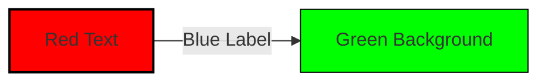

# Mermaid CSS Architecture Analysis

## Overview

This document explains how the two Mermaid CSS files work together, their precedence, and how styling is applied to Mermaid diagrams in the Matchina project.

## File Structure

### 1. `docs/src/components/mermaid.css`
- **Purpose**: Base Mermaid diagram styling for the docs site
- **Scope**: Applied to all Mermaid diagrams in the documentation
- **Loaded**: As a component import in the Astro docs site

### 2. `src/viz/MermaidInspector.css` 
- **Purpose**: Theme-specific and interactive styling for MermaidInspector component
- **Scope**: Applied only when MermaidInspector component is used
- **Loaded**: Bundled with the MermaidInspector React component

## CSS Precedence Analysis

### Loading Order
1. **Mermaid library CSS** (bundled with Mermaid)
2. **`docs/src/components/mermaid.css`** (docs site import)
3. **`src/viz/MermaidInspector.css`** (component import)

### Specificity Hierarchy (from highest to lowest)
1. **Mermaid ID-based selectors**: `#mermaid-1 .edgeLabel p` (highest specificity)
2. **Component class selectors**: `.edgeLabel p` (medium specificity) 
3. **Theme attribute selectors**: `html[data-theme="dark"] .edgeLabel` (medium specificity)
4. **Mermaid base classes**: `.edgeLabel` (lowest specificity)

## Current Styling Issues

### The Problem
From dev tools inspection, we're seeing:
```css
#mermaid-1 .edgeLabel p {
    background-color: rgba(232, 232, 232, 0.8);  /* Light gray */
}
#mermaid-1 .label text, #mermaid-1 span {
    fill: #333;  /* Dark text */
    color: #333;  /* Dark text */
}
```

This **overrides** our theme-specific styles because:
- Mermaid uses **ID-based selectors** (`#mermaid-1`) which have higher specificity
- Mermaid sets **hardcoded colors** instead of CSS variables
- Mermaid applies styles **after** our CSS loads

### Why Both Files Are Needed

#### `docs/src/components/mermaid.css` - Base Diagram Styling
- **Purpose**: Override Mermaid's default appearance to match the docs theme
- **Handles**: 
  - Cluster styling (transparent backgrounds)
  - Basic edge label appearance
  - Dark/light theme base colors
- **Limitation**: Cannot override Mermaid's ID-based selectors effectively

#### `src/viz/MermaidInspector.css` - Interactive Component Styling  
- **Purpose**: Handle interactive features and component-specific styling
- **Handles**:
  - Edge highlighting (`.edge-active`, `.edge-inactive`, `.edge-ancestor`)
  - State highlighting (`.state-highlight`, `.active`)
  - Interactive hover states
  - Component-specific overrides
- **Advantage**: Can use higher specificity selectors for component instances

## Mermaid's Internal Styling

### Diagram DSL Color Directives
Mermaid diagrams can specify colors directly in the DSL:


### Generated CSS Structure
Mermaid generates unique IDs for each diagram instance:
```css
#mermaid-1 .edgeLabel p { /* Mermaid's generated styles */ }
#mermaid-2 .edgeLabel p { /* Different instance */ }
```

## Styling Strategies

### 1. High Specificity Override (Recommended)
Use selectors that can beat Mermaid's ID-based selectors:
```css
/* In MermaidInspector.css */
html[data-theme="dark"] [id^="mermaid-"] .edgeLabel p {
    background-color: #333 !important;
    color: white !important;
}
```

### 2. CSS Variable Injection
Override Mermaid's color variables before initialization:
```javascript
// Set CSS variables before Mermaid renders
document.documentElement.style.setProperty('--mermaid-edge-label-bg', '#333');
```

### 3. Post-Render DOM Manipulation
Apply styles after Mermaid renders using JavaScript:
```javascript
// In MermaidInspector onRender callback
container.querySelectorAll('.edgeLabel p').forEach(el => {
    el.style.backgroundColor = '#333';
    el.style.color = 'white';
});
```

## Current Implementation Analysis

### What Works (And Why)

#### ✅ **Node Highlighting Works**
```css
html[data-theme="dark"] .node.active path,
html[data-theme="dark"] .node.active path[style] {
    fill: rgb(147, 112, 219) !important;
    stroke: #a78bfa !important;
}
```
**Why it works**: These selectors have **higher specificity** than Mermaid's default node styling because they include:
- Theme attribute selector (`html[data-theme="dark"]`)
- Element type selector (`path`) 
- Attribute selector (`[style]`)
- Combined specificity beats Mermaid's basic `.node` selectors

#### ✅ **Edge Interactive Classes Work**
```css
.edge-active {
    background-color: var(--sl-color-gray-5) !important;
    color: var(--sl-color-accent-high) !important;
    font-weight: 600 !important;
}
```
**Why it works**: These classes are **applied via JavaScript** in the `onRender` callback, not via CSS cascade. The JavaScript directly sets `element.classList.add('edge-active')` which overrides CSS rules.

#### ✅ **State Chart Highlighting Works**
```css
.state-highlight {
    /* Applied via JavaScript, not CSS cascade */
}
```
**Why it works**: Applied programmatically through DOM manipulation, bypassing CSS specificity issues.

### What Doesn't Work (And Why)

#### ❌ **Dark Theme Edge Label Base Styling**
```css
html[data-theme="dark"] .edgeLabel text {
    fill: #e5e7eb !important;  /* Gets overridden */
}
```
**Why it fails**: 
- **Lower specificity** than Mermaid's `#mermaid-1 .label text, #mermaid-1 span`
- Mermaid applies styles **after** our CSS loads
- Mermaid uses **hardcoded values** (`fill: #333`) instead of CSS variables

#### ❌ **Edge Label Background Colors**
```css
html[data-theme="dark"] .edgeLabel rect {
    fill: var(--sl-color-gray-3) !important;  /* Gets overridden */
}
```
**Why it fails**:
- Mermaid's `#mermaid-1 .edgeLabel p` with `background-color: rgba(232, 232, 232, 0.8)` wins
- Our selector lacks the specificity to beat Mermaid's ID-based selector

### The Pattern: What Works vs What Doesn't

| Working | Not Working | Why |
|---------|-------------|-----|
| Node styling with theme + element selectors | Edge label text styling | Node selectors have higher specificity |
| JavaScript-applied classes (`.edge-active`) | CSS-applied theme styles | JavaScript bypasses CSS cascade |
| Multi-part selectors (`html[data-theme="dark"] .node.active path`) | Simple selectors (`.edgeLabel text`) | More specific selectors win |

### Key Insight: **Specificity + Application Method**

The working styles share two characteristics:
1. **High specificity selectors** that beat Mermaid's defaults
2. **Applied via JavaScript** or **multi-part selectors** that increase specificity

The failing styles are:
1. **Lower specificity** than Mermaid's ID-based selectors
2. **Applied via CSS cascade** which Mermaid overrides

## Recommended Fixes (Based on Working Patterns)

### 1. Fix Dark Theme Edge Labels - Use JavaScript Approach (Like Edge-Active)
Since `.edge-active` works via JavaScript, apply the same pattern to base edge labels:

```javascript
// In MermaidInspector onRender callback
const isDarkTheme = document.documentElement.getAttribute('data-theme') === 'dark';
if (isDarkTheme) {
    container.querySelectorAll('.edgeLabel p').forEach(el => {
        el.style.backgroundColor = '#333';
        el.style.color = '#e5e7eb';
    });
    container.querySelectorAll('.edgeLabel text').forEach(el => {
        el.style.fill = '#e5e7eb';
    });
}
```

### 2. Alternative: Higher Specificity CSS (Like Node Styling)
Follow the pattern that works for nodes:

```css
/* This pattern works for nodes, should work for edges too */
html[data-theme="dark"] [id^="mermaid-"] .edgeLabel p,
html[data-theme="dark"] [id^="mermaid-"] .edgeLabel span {
    background-color: #333 !important;
    color: #e5e7eb !important;
}

html[data-theme="dark"] [id^="mermaid-"] .label text,
html[data-theme="dark"] [id^="mermaid-"] .label span {
    fill: #e5e7eb !important;
    color: #e5e7eb !important;
}
```

### 3. Why JavaScript Approach is Probably Better
- **Consistent with existing working pattern** (`.edge-active` uses JavaScript)
- **Guaranteed to work** regardless of Mermaid's CSS changes
- **Can respond to theme changes** dynamically
- **Avoids specificity wars** with Mermaid's generated CSS

## Conclusion

Both CSS files are necessary and serve different purposes:
- **`mermaid.css`**: Base theme integration for docs
- **`MermaidInspector.css`**: Interactive component features

The main issue is **CSS specificity** - Mermaid's ID-based selectors override our theme styles. The solution is to use **higher specificity selectors** or **JavaScript DOM manipulation** to ensure our dark theme styling takes effect.
