# Beads Task Report - 2026-01-04

```mermaid
graph TD
    %% Task Dependency Overview - Birds Eye View
    %% Soft pastel colors with rounded corners for readability
    %% Click nodes to jump to task details

    20["🔄 HSM Epic Review\l20"]
    style 20 fill:#E8F5E8,stroke:#90EE90,stroke-width:2px,color:#495057,rx:8,ry:8
    click 20 "#task-20" "View 20 details"

    18 --> 20
    18["📋 HSM Epic - NEVER PUT I\l18"]
    style 18 fill:#FFE5CC,stroke:#FFB366,stroke-width:2px,color:#495057,rx:8,ry:8
    click 18 "#task-18" "View 18 details"

    j1on.2["🔄 HSM Combobox ReactFlow\lj1on.2"]
    style j1on.2 fill:#E8F5E8,stroke:#90EE90,stroke-width:2px,color:#495057,rx:8,ry:8
    click j1on.2 "#task-j1on.2" "View j1on.2 details"

    j1on --> j1on.2
    j1on["📋 ReactFlow Initial View\lj1on"]
    style j1on fill:#FFE5CC,stroke:#FFB366,stroke-width:2px,color:#495057,rx:8,ry:8
    click j1on "#task-j1on" "View j1on details"

    j1on.3["🔄 HSM Checkout ReactFlow\lj1on.3"]
    style j1on.3 fill:#E8F5E8,stroke:#90EE90,stroke-width:2px,color:#495057,rx:8,ry:8
    click j1on.3 "#task-j1on.3" "View j1on.3 details"

    j1on --> j1on.3
    j1on["📋 ReactFlow Initial View\lj1on"]
    style j1on fill:#FFE5CC,stroke:#FFB366,stroke-width:2px,color:#495057,rx:8,ry:8
    click j1on "#task-j1on" "View j1on details"

    j1on.4["📋 ReactFlow Layout Algor\lj1on.4"]
    style j1on.4 fill:#FFE5CC,stroke:#FFB366,stroke-width:2px,color:#495057,rx:8,ry:8
    click j1on.4 "#task-j1on.4" "View j1on.4 details"

    j1on --> j1on.4
    j1on["📋 ReactFlow Initial View\lj1on"]
    style j1on fill:#FFE5CC,stroke:#FFB366,stroke-width:2px,color:#495057,rx:8,ry:8
    click j1on "#task-j1on" "View j1on details"

    mnpw["📋 ReactFlow Toggle Edge \lmnpw"]
    style mnpw fill:#FFE5CC,stroke:#FFB366,stroke-width:2px,color:#495057,rx:8,ry:8
    click mnpw "#task-mnpw" "View mnpw details"

    2iky --> mnpw
    2iky["🔄 Fix Mermaid Toggle Cap\l2iky"]
    style 2iky fill:#E8F5E8,stroke:#90EE90,stroke-width:2px,color:#495057,rx:8,ry:8
    click 2iky "#task-2iky" "View 2iky details"

    qx8r["📋 Verify npm publishing \lqx8r"]
    style qx8r fill:#FFE5CC,stroke:#FFB366,stroke-width:2px,color:#495057,rx:8,ry:8
    click qx8r "#task-qx8r" "View qx8r details"

    1p35 --> qx8r
    1p35["📋 Next NPM Release\l1p35"]
    style 1p35 fill:#FFE5CC,stroke:#FFB366,stroke-width:2px,color:#495057,rx:8,ry:8
    click 1p35 "#task-1p35" "View 1p35 details"

    18 --> 1p35
    18["📋 HSM Epic - NEVER PUT I\l18"]
    style 18 fill:#FFE5CC,stroke:#FFB366,stroke-width:2px,color:#495057,rx:8,ry:8
    click 18 "#task-18" "View 18 details"

```

## Task Overview

- 🔄 [HSM Epic Review](http://localhost:3000/#/board?issue=matchina-20) `20`
  - 📋 [HSM Epic - NEVER PUT IN PROGRESS](http://localhost:3000/#/board?issue=matchina-18) `18`
- 🔄 [HSM Combobox ReactFlow Initial View](http://localhost:3000/#/board?issue=matchina-j1on.2) `j1on.2`
  - 📋 [ReactFlow Initial View Optimization - All Examples](http://localhost:3000/#/board?issue=matchina-j1on) `j1on`
- 🔄 [HSM Checkout ReactFlow Initial View](http://localhost:3000/#/board?issue=matchina-j1on.3) `j1on.3`
  - 📋 [ReactFlow Initial View Optimization - All Examples](http://localhost:3000/#/board?issue=matchina-j1on) `j1on`
- 📋 [ReactFlow Layout Algorithm Analysis](http://localhost:3000/#/board?issue=matchina-j1on.4) `j1on.4`
  - 📋 [ReactFlow Initial View Optimization - All Examples](http://localhost:3000/#/board?issue=matchina-j1on) `j1on`
- 📋 [ReactFlow Toggle Edge Routing - Match ForceGraph/Mermaid Quality](http://localhost:3000/#/board?issue=matchina-mnpw) `mnpw`
  - 🔄 [Fix Mermaid Toggle Capture - Shows App UI Instead of Diagram](http://localhost:3000/#/board?issue=matchina-2iky) `2iky`
- 📋 [Verify npm publishing and consumption compatibility](http://localhost:3000/#/board?issue=matchina-qx8r) `qx8r`
  - 📋 [Next NPM Release](http://localhost:3000/#/board?issue=matchina-1p35) `1p35`
    - 📋 [HSM Epic - NEVER PUT IN PROGRESS](http://localhost:3000/#/board?issue=matchina-18) `18`
## Summary Statistics

| Status | Count |
|--------|-------|
| 📋 Open | 18 |
| 🔄 In Progress | 10 |
| 🚫 Blocked | 0 |
| **Total Active** | **28** |

| Priority | Count |
|----------|-------|
| 🔴 P0 (Critical) | 0 |
| 🟠 P1 (High) | 4 |
| 🟡 P2 (Medium) | 22 |
| 🟢 P3 (Low) | 2 |

