# Beads Task Report - 2026-01-04

```mermaid
graph TD
    %% Task Dependency Overview - Birds Eye View
    %% Top-to-Bottom: Big things up top, arrows point down to dependencies
    %% Soft pastel colors with rounded corners for readability
    %% Parent-child relationships shown as nested subgraphs

    subgraph node18["HSM Epic - NEVER"]
        node18_parent["HSM Epic - NEVER"]
        style node18_parent fill:#FFE5CC,stroke:#FFB366,stroke-width:2px,color:#495057,rx:8,ry:8

        node1p35_child["Next NPM"]
        style node1p35_child fill:#FFE5CC,stroke:#FFB366,stroke-width:2px,color:#495057,rx:8,ry:8

        node20_child["HSM Epic"]
        style node20_child fill:#E8F5E8,stroke:#90EE90,stroke-width:2px,color:#495057,rx:8,ry:8

        nodej1on_child["ReactFlow"]
        style nodej1on_child fill:#FFE5CC,stroke:#FFB366,stroke-width:2px,color:#495057,rx:8,ry:8

        nodej1on2_child["HSM Combo"]
        style nodej1on2_child fill:#E8F5E8,stroke:#90EE90,stroke-width:2px,color:#495057,rx:8,ry:8

        nodej1on3_child["HSM Check"]
        style nodej1on3_child fill:#E8F5E8,stroke:#90EE90,stroke-width:2px,color:#495057,rx:8,ry:8

        nodej1on4_child["ReactFlow"]
        style nodej1on4_child fill:#FFE5CC,stroke:#FFB366,stroke-width:2px,color:#495057,rx:8,ry:8

    end

    subgraph node63u["Externalize visua"]
        node63u_parent["Externalize visua"]
        style node63u_parent fill:#E5F3FF,stroke:#87CEEB,stroke-width:2px,color:#495057,rx:8,ry:8

        node18_child["HSM Epic"]
        style node18_child fill:#FFE5CC,stroke:#FFB366,stroke-width:2px,color:#495057,rx:8,ry:8

    end

    subgraph nodej1on["ReactFlow Initial"]
        nodej1on_parent["ReactFlow Initial"]
        style nodej1on_parent fill:#FFE5CC,stroke:#FFB366,stroke-width:2px,color:#495057,rx:8,ry:8

        nodej1on2_child["HSM Combo"]
        style nodej1on2_child fill:#E8F5E8,stroke:#90EE90,stroke-width:2px,color:#495057,rx:8,ry:8

        nodej1on3_child["HSM Check"]
        style nodej1on3_child fill:#E8F5E8,stroke:#90EE90,stroke-width:2px,color:#495057,rx:8,ry:8

        nodej1on4_child["ReactFlow"]
        style nodej1on4_child fill:#FFE5CC,stroke:#FFB366,stroke-width:2px,color:#495057,rx:8,ry:8

    end

    nodemnpw["ReactFlow Toggle"]
    style nodemnpw fill:#FFE5CC,stroke:#FFB366,stroke-width:2px,color:#495057,rx:8,ry:8

    nodemnpw --> node2iky
    node2iky["Fix Mermaid Toggl"]
    style node2iky fill:#E5F3FF,stroke:#87CEEB,stroke-width:2px,color:#495057,rx:8,ry:8

    nodemnpw --> nodeo7x5
    nodeo7x5["ReactFlow Edge Cu"]
    style nodeo7x5 fill:#E8F5E8,stroke:#90EE90,stroke-width:2px,color:#495057,rx:8,ry:8

    nodeqx8r["Verify npm publis"]
    style nodeqx8r fill:#FFE5CC,stroke:#FFB366,stroke-width:2px,color:#495057,rx:8,ry:8

    nodeqx8r --> node1p35
    node1p35["Next NPM Release"]
    style node1p35 fill:#FFE5CC,stroke:#FFB366,stroke-width:2px,color:#495057,rx:8,ry:8

    node1p35 --> node18_parent
    node18_parent --> node15
    node15["CRITICAL: Fix Car"]
    style node15 fill:#E5F3FF,stroke:#87CEEB,stroke-width:2px,color:#495057,rx:8,ry:8

    node18_parent --> node14
    node14["Review flattened-"]
    style node14 fill:#E5F3FF,stroke:#87CEEB,stroke-width:2px,color:#495057,rx:8,ry:8

    node18_parent --> node13
    node13["Review parent-tra"]
    style node13 fill:#E5F3FF,stroke:#87CEEB,stroke-width:2px,color:#495057,rx:8,ry:8

    node18_parent --> node12
    node12["Investigate shape"]
    style node12 fill:#E5F3FF,stroke:#87CEEB,stroke-width:2px,color:#495057,rx:8,ry:8

    node18_parent --> node63u_parent
    node18_parent --> node9mu
    node9mu["Fix createDeclara"]
    style node9mu fill:#E5F3FF,stroke:#87CEEB,stroke-width:2px,color:#495057,rx:8,ry:8

    node18_parent --> noden19
    noden19["Fix traffic light"]
    style noden19 fill:#E5F3FF,stroke:#87CEEB,stroke-width:2px,color:#495057,rx:8,ry:8

    node18_parent --> nodeoke
    nodeoke["Fix checkout paym"]
    style nodeoke fill:#E5F3FF,stroke:#87CEEB,stroke-width:2px,color:#495057,rx:8,ry:8

    node18_parent --> nodevqf
    nodevqf["Add combo box tag"]
    style nodevqf fill:#E5F3FF,stroke:#87CEEB,stroke-width:2px,color:#495057,rx:8,ry:8

    node18_parent --> nodewxi
    nodewxi["Fix createHierarc"]
    style nodewxi fill:#E5F3FF,stroke:#87CEEB,stroke-width:2px,color:#495057,rx:8,ry:8

    node18_parent --> nodeya6
    nodeya6["Fix checkout paym"]
    style nodeya6 fill:#E5F3FF,stroke:#87CEEB,stroke-width:2px,color:#495057,rx:8,ry:8

    node18_parent --> nodeyde
    nodeyde["Open questions l"]
    style nodeyde fill:#E5F3FF,stroke:#87CEEB,stroke-width:2px,color:#495057,rx:8,ry:8

    node18_parent --> nodeywf
    nodeywf["Setup git-town fo"]
    style nodeywf fill:#E5F3FF,stroke:#87CEEB,stroke-width:2px,color:#495057,rx:8,ry:8

    node18_parent --> node8et
    node8et["Move HSMMermaidIn"]
    style node8et fill:#E5F3FF,stroke:#87CEEB,stroke-width:2px,color:#495057,rx:8,ry:8

    node20["HSM Epic Review"]
    style node20 fill:#E8F5E8,stroke:#90EE90,stroke-width:2px,color:#495057,rx:8,ry:8

    node20 --> node18_parent
    nodej1on_parent --> node18_parent
    nodej1on2["HSM Combobox Reac"]
    style nodej1on2 fill:#E8F5E8,stroke:#90EE90,stroke-width:2px,color:#495057,rx:8,ry:8

    nodej1on2 --> nodej1on_parent
    nodej1on2 --> node18_parent
    nodej1on3["HSM Checkout Reac"]
    style nodej1on3 fill:#E8F5E8,stroke:#90EE90,stroke-width:2px,color:#495057,rx:8,ry:8

    nodej1on3 --> nodej1on_parent
    nodej1on3 --> node18_parent
    nodej1on4["ReactFlow Layout"]
    style nodej1on4 fill:#FFE5CC,stroke:#FFB366,stroke-width:2px,color:#495057,rx:8,ry:8

    nodej1on4 --> nodej1on_parent
    nodej1on4 --> node18_parent
```

## Task Overview

- 🔄 [HSM Epic Review](http://localhost:3000/#/board?issue=matchina-node20) `node20`
  - 📋 [HSM Epic - NEVER PUT IN PROGRESS](http://localhost:3000/#/board?issue=matchina-node18) `node18`
    - ✅ [CRITICAL: Fix Cardinal Rule violations - transitions defined as variables break type safety](http://localhost:3000/#/board?issue=matchina-node15) `node15`
    - ✅ [Review flattened-child-exit uncovered lines - 93.1% coverage but missing lines 58,77. Check if child exit bubbling logic is complete or has unused complexity.](http://localhost:3000/#/board?issue=matchina-node14) `node14`
    - ✅ [Review parent-transition-fallback uncovered lines - 74.07% coverage but missing lines 59-76. Determine if fallback logic can be simplified or if tests missing for edge cases.](http://localhost:3000/#/board?issue=matchina-node13) `node13`
    - ✅ [Investigate shape-store low coverage - 14.28% lines. Determine if shape store subscription logic is needed or can be simplified. Currently used by createFlatMachine for visualization.](http://localhost:3000/#/board?issue=matchina-node12) `node12`
    - ✅ [Externalize visualizers to core src package](http://localhost:3000/#/board?issue=matchina-node63u) `node63u`
    - ✅ [Fix createDeclarativeFlatMachine API naming](http://localhost:3000/#/board?issue=matchina-node9mu) `node9mu`
    - ✅ [Fix traffic light flattened HSM diagram extra states](http://localhost:3000/#/board?issue=matchina-noden19) `noden19`
    - ✅ [Fix checkout payment action any casts](http://localhost:3000/#/board?issue=matchina-nodeoke) `nodeoke`
    - ✅ [Add combo box tag deletion](http://localhost:3000/#/board?issue=matchina-nodevqf) `nodevqf`
    - ✅ [Fix createHierarchicalMachine API naming](http://localhost:3000/#/board?issue=matchina-nodewxi) `nodewxi`
    - ✅ [Fix checkout payment stuck in authorizing state](http://localhost:3000/#/board?issue=matchina-nodeya6) `nodeya6`
    - ✅ [Open questions (low priority)](http://localhost:3000/#/board?issue=matchina-nodeyde) `nodeyde`
    - ✅ [Setup git-town for stacked branches](http://localhost:3000/#/board?issue=matchina-nodeywf) `nodeywf`
    - ✅ [Move HSMMermaidInspector to src/viz package](http://localhost:3000/#/board?issue=matchina-node8et) `node8et`
- 🔄 [HSM Combobox ReactFlow Initial View](http://localhost:3000/#/board?issue=matchina-nodej1on2) `nodej1on2`
  - 📋 [ReactFlow Initial View Optimization - All Examples](http://localhost:3000/#/board?issue=matchina-nodej1on) `nodej1on`
    - 📋 [HSM Epic - NEVER PUT IN PROGRESS](http://localhost:3000/#/board?issue=matchina-node18) `node18`
      - ✅ [CRITICAL: Fix Cardinal Rule violations - transitions defined as variables break type safety](http://localhost:3000/#/board?issue=matchina-node15) `node15`
      - ✅ [Review flattened-child-exit uncovered lines - 93.1% coverage but missing lines 58,77. Check if child exit bubbling logic is complete or has unused complexity.](http://localhost:3000/#/board?issue=matchina-node14) `node14`
      - ✅ [Review parent-transition-fallback uncovered lines - 74.07% coverage but missing lines 59-76. Determine if fallback logic can be simplified or if tests missing for edge cases.](http://localhost:3000/#/board?issue=matchina-node13) `node13`
      - ✅ [Investigate shape-store low coverage - 14.28% lines. Determine if shape store subscription logic is needed or can be simplified. Currently used by createFlatMachine for visualization.](http://localhost:3000/#/board?issue=matchina-node12) `node12`
      - ✅ [Externalize visualizers to core src package](http://localhost:3000/#/board?issue=matchina-node63u) `node63u`
      - ✅ [Fix createDeclarativeFlatMachine API naming](http://localhost:3000/#/board?issue=matchina-node9mu) `node9mu`
      - ✅ [Fix traffic light flattened HSM diagram extra states](http://localhost:3000/#/board?issue=matchina-noden19) `noden19`
      - ✅ [Fix checkout payment action any casts](http://localhost:3000/#/board?issue=matchina-nodeoke) `nodeoke`
      - ✅ [Add combo box tag deletion](http://localhost:3000/#/board?issue=matchina-nodevqf) `nodevqf`
      - ✅ [Fix createHierarchicalMachine API naming](http://localhost:3000/#/board?issue=matchina-nodewxi) `nodewxi`
      - ✅ [Fix checkout payment stuck in authorizing state](http://localhost:3000/#/board?issue=matchina-nodeya6) `nodeya6`
      - ✅ [Open questions (low priority)](http://localhost:3000/#/board?issue=matchina-nodeyde) `nodeyde`
      - ✅ [Setup git-town for stacked branches](http://localhost:3000/#/board?issue=matchina-nodeywf) `nodeywf`
      - ✅ [Move HSMMermaidInspector to src/viz package](http://localhost:3000/#/board?issue=matchina-node8et) `node8et`
- 🔄 [HSM Checkout ReactFlow Initial View](http://localhost:3000/#/board?issue=matchina-nodej1on3) `nodej1on3`
  - 📋 [ReactFlow Initial View Optimization - All Examples](http://localhost:3000/#/board?issue=matchina-nodej1on) `nodej1on`
    - 📋 [HSM Epic - NEVER PUT IN PROGRESS](http://localhost:3000/#/board?issue=matchina-node18) `node18`
      - ✅ [CRITICAL: Fix Cardinal Rule violations - transitions defined as variables break type safety](http://localhost:3000/#/board?issue=matchina-node15) `node15`
      - ✅ [Review flattened-child-exit uncovered lines - 93.1% coverage but missing lines 58,77. Check if child exit bubbling logic is complete or has unused complexity.](http://localhost:3000/#/board?issue=matchina-node14) `node14`
      - ✅ [Review parent-transition-fallback uncovered lines - 74.07% coverage but missing lines 59-76. Determine if fallback logic can be simplified or if tests missing for edge cases.](http://localhost:3000/#/board?issue=matchina-node13) `node13`
      - ✅ [Investigate shape-store low coverage - 14.28% lines. Determine if shape store subscription logic is needed or can be simplified. Currently used by createFlatMachine for visualization.](http://localhost:3000/#/board?issue=matchina-node12) `node12`
      - ✅ [Externalize visualizers to core src package](http://localhost:3000/#/board?issue=matchina-node63u) `node63u`
      - ✅ [Fix createDeclarativeFlatMachine API naming](http://localhost:3000/#/board?issue=matchina-node9mu) `node9mu`
      - ✅ [Fix traffic light flattened HSM diagram extra states](http://localhost:3000/#/board?issue=matchina-noden19) `noden19`
      - ✅ [Fix checkout payment action any casts](http://localhost:3000/#/board?issue=matchina-nodeoke) `nodeoke`
      - ✅ [Add combo box tag deletion](http://localhost:3000/#/board?issue=matchina-nodevqf) `nodevqf`
      - ✅ [Fix createHierarchicalMachine API naming](http://localhost:3000/#/board?issue=matchina-nodewxi) `nodewxi`
      - ✅ [Fix checkout payment stuck in authorizing state](http://localhost:3000/#/board?issue=matchina-nodeya6) `nodeya6`
      - ✅ [Open questions (low priority)](http://localhost:3000/#/board?issue=matchina-nodeyde) `nodeyde`
      - ✅ [Setup git-town for stacked branches](http://localhost:3000/#/board?issue=matchina-nodeywf) `nodeywf`
      - ✅ [Move HSMMermaidInspector to src/viz package](http://localhost:3000/#/board?issue=matchina-node8et) `node8et`
- 📋 [ReactFlow Layout Algorithm Analysis](http://localhost:3000/#/board?issue=matchina-nodej1on4) `nodej1on4`
  - 📋 [ReactFlow Initial View Optimization - All Examples](http://localhost:3000/#/board?issue=matchina-nodej1on) `nodej1on`
    - 📋 [HSM Epic - NEVER PUT IN PROGRESS](http://localhost:3000/#/board?issue=matchina-node18) `node18`
      - ✅ [CRITICAL: Fix Cardinal Rule violations - transitions defined as variables break type safety](http://localhost:3000/#/board?issue=matchina-node15) `node15`
      - ✅ [Review flattened-child-exit uncovered lines - 93.1% coverage but missing lines 58,77. Check if child exit bubbling logic is complete or has unused complexity.](http://localhost:3000/#/board?issue=matchina-node14) `node14`
      - ✅ [Review parent-transition-fallback uncovered lines - 74.07% coverage but missing lines 59-76. Determine if fallback logic can be simplified or if tests missing for edge cases.](http://localhost:3000/#/board?issue=matchina-node13) `node13`
      - ✅ [Investigate shape-store low coverage - 14.28% lines. Determine if shape store subscription logic is needed or can be simplified. Currently used by createFlatMachine for visualization.](http://localhost:3000/#/board?issue=matchina-node12) `node12`
      - ✅ [Externalize visualizers to core src package](http://localhost:3000/#/board?issue=matchina-node63u) `node63u`
      - ✅ [Fix createDeclarativeFlatMachine API naming](http://localhost:3000/#/board?issue=matchina-node9mu) `node9mu`
      - ✅ [Fix traffic light flattened HSM diagram extra states](http://localhost:3000/#/board?issue=matchina-noden19) `noden19`
      - ✅ [Fix checkout payment action any casts](http://localhost:3000/#/board?issue=matchina-nodeoke) `nodeoke`
      - ✅ [Add combo box tag deletion](http://localhost:3000/#/board?issue=matchina-nodevqf) `nodevqf`
      - ✅ [Fix createHierarchicalMachine API naming](http://localhost:3000/#/board?issue=matchina-nodewxi) `nodewxi`
      - ✅ [Fix checkout payment stuck in authorizing state](http://localhost:3000/#/board?issue=matchina-nodeya6) `nodeya6`
      - ✅ [Open questions (low priority)](http://localhost:3000/#/board?issue=matchina-nodeyde) `nodeyde`
      - ✅ [Setup git-town for stacked branches](http://localhost:3000/#/board?issue=matchina-nodeywf) `nodeywf`
      - ✅ [Move HSMMermaidInspector to src/viz package](http://localhost:3000/#/board?issue=matchina-node8et) `node8et`
- 📋 [ReactFlow Toggle Edge Routing - Match ForceGraph/Mermaid Quality](http://localhost:3000/#/board?issue=matchina-nodemnpw) `nodemnpw`
  - ✅ [Fix Mermaid Toggle Capture - Shows App UI Instead of Diagram](http://localhost:3000/#/board?issue=matchina-node2iky) `node2iky`
  - 🔄 [ReactFlow Edge Curvature Not Working - Changes Not Applied](http://localhost:3000/#/board?issue=matchina-nodeo7x5) `nodeo7x5`
- 📋 [Verify npm publishing and consumption compatibility](http://localhost:3000/#/board?issue=matchina-nodeqx8r) `nodeqx8r`
  - 📋 [Next NPM Release](http://localhost:3000/#/board?issue=matchina-node1p35) `node1p35`
    - 📋 [HSM Epic - NEVER PUT IN PROGRESS](http://localhost:3000/#/board?issue=matchina-node18) `node18`
      - ✅ [CRITICAL: Fix Cardinal Rule violations - transitions defined as variables break type safety](http://localhost:3000/#/board?issue=matchina-node15) `node15`
      - ✅ [Review flattened-child-exit uncovered lines - 93.1% coverage but missing lines 58,77. Check if child exit bubbling logic is complete or has unused complexity.](http://localhost:3000/#/board?issue=matchina-node14) `node14`
      - ✅ [Review parent-transition-fallback uncovered lines - 74.07% coverage but missing lines 59-76. Determine if fallback logic can be simplified or if tests missing for edge cases.](http://localhost:3000/#/board?issue=matchina-node13) `node13`
      - ✅ [Investigate shape-store low coverage - 14.28% lines. Determine if shape store subscription logic is needed or can be simplified. Currently used by createFlatMachine for visualization.](http://localhost:3000/#/board?issue=matchina-node12) `node12`
      - ✅ [Externalize visualizers to core src package](http://localhost:3000/#/board?issue=matchina-node63u) `node63u`
      - ✅ [Fix createDeclarativeFlatMachine API naming](http://localhost:3000/#/board?issue=matchina-node9mu) `node9mu`
      - ✅ [Fix traffic light flattened HSM diagram extra states](http://localhost:3000/#/board?issue=matchina-noden19) `noden19`
      - ✅ [Fix checkout payment action any casts](http://localhost:3000/#/board?issue=matchina-nodeoke) `nodeoke`
      - ✅ [Add combo box tag deletion](http://localhost:3000/#/board?issue=matchina-nodevqf) `nodevqf`
      - ✅ [Fix createHierarchicalMachine API naming](http://localhost:3000/#/board?issue=matchina-nodewxi) `nodewxi`
      - ✅ [Fix checkout payment stuck in authorizing state](http://localhost:3000/#/board?issue=matchina-nodeya6) `nodeya6`
      - ✅ [Open questions (low priority)](http://localhost:3000/#/board?issue=matchina-nodeyde) `nodeyde`
      - ✅ [Setup git-town for stacked branches](http://localhost:3000/#/board?issue=matchina-nodeywf) `nodeywf`
      - ✅ [Move HSMMermaidInspector to src/viz package](http://localhost:3000/#/board?issue=matchina-node8et) `node8et`
## Summary Statistics

| Status | Count |
|--------|-------|
| 📋 Open | 18 |
| 🔄 In Progress | 10 |
| 🚫 Blocked | 0 |
| **Total Active** | **28** |

| Priority | Count |
|----------|-------|
| 🔴 P0 (Critical) | 0 |
| 🟠 P1 (High) | 4 |
| 🟡 P2 (Medium) | 22 |
| 🟢 P3 (Low) | 2 |

