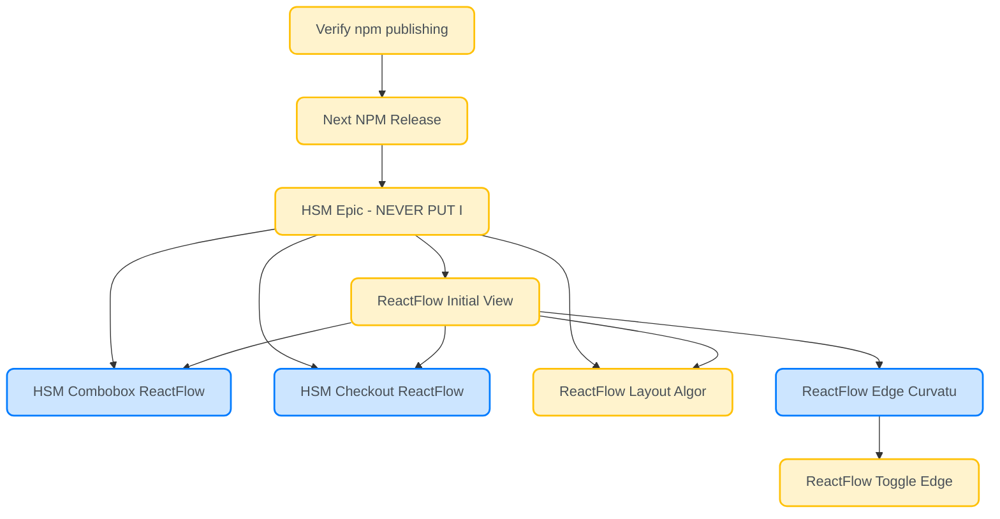

# Beads Task Report - 2026-01-06

## Task Overview

- 📋 [Verify npm publishing and consumption compatibility](http://localhost:3000/#/board?issue=matchina-nodeqx8r) `nodeqx8r`
  - 📋 [Next NPM Release](http://localhost:3000/#/board?issue=matchina-node1p35) `node1p35`
    - 📋 [HSM Epic - NEVER PUT IN PROGRESS](http://localhost:3000/#/board?issue=matchina-node18) `node18`
      - 📋 [ReactFlow Initial View Optimization - All Examples](http://localhost:3000/#/board?issue=matchina-nodej1on) `nodej1on`
        - 🔄 [HSM Combobox ReactFlow Initial View](http://localhost:3000/#/board?issue=matchina-nodej1on2) `nodej1on2`
        - 🔄 [HSM Checkout ReactFlow Initial View](http://localhost:3000/#/board?issue=matchina-nodej1on3) `nodej1on3`
        - 📋 [ReactFlow Layout Algorithm Analysis](http://localhost:3000/#/board?issue=matchina-nodej1on4) `nodej1on4`
        - 🔄 [ReactFlow Edge Curvature Not Working - Changes Not Applied](http://localhost:3000/#/board?issue=matchina-nodeo7x5) `nodeo7x5`
          - 📋 [ReactFlow Toggle Edge Routing - Match ForceGraph/Mermaid Quality](http://localhost:3000/#/board?issue=matchina-nodemnpw) `nodemnpw`
## Summary Statistics

| Status | Count |
|--------|-------|
| 📋 Open | 17 |
| 📋 Ready | 13 |
| 🔄 In Progress | 12 |
| 🚫 Blocked | 8 |
| **Total Active** | **33** |

| Priority | Count |
|----------|-------|
| 🔴 P0 (Critical) | 0 |
| 🟠 P1 (High) | 4 |
| 🟡 P2 (Medium) | 25 |
| 🟢 P3 (Low) | 2 |

