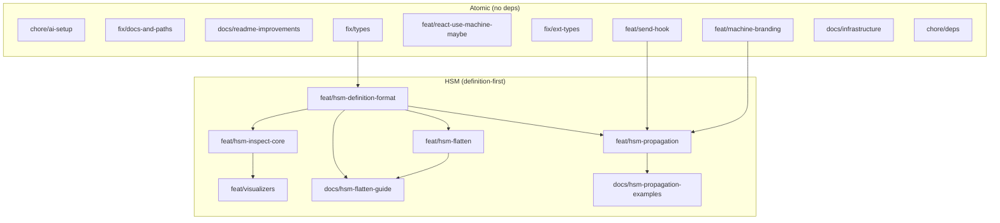

# Branch Plan: Splitting hierarchical-machines-with-viz-r5

This document plans how to split the `hierarchical-machines-with-viz-r5` branch into atomic, independent feature/fix branches from `main`.

---

## Change Categories

### 1. AI Setup (atomic, no deps)
**Branch**: `chore/ai-setup`

Files:
- `AGENTS.md` (new)
- `CLAUDE.md` (new)
- `docs/AGENTS.md` (modified)
- `.claude/settings.local.json` (new)
- `.beads/*` (new directory)

**Notes**: Combine AI agent guidance + local issue tracking setup. Independent of all other changes.

---

### 2. Low-Intensity Fixes (atomic, no deps)
**Branch**: `fix/docs-and-paths`

Files:
- `docs/astro.config.mjs` (formatting/path fixes only, NOT new nav items)
- `docs/src/code/examples/async-calculator/AsyncCalculatorView.tsx`
- `docs/src/code/examples/stopwatch-using-react-state-using-transitionhooks/useStopwatch.ts`
- `docs/src/code/examples/stopwatch/machine.ts`
- `docs/src/code/examples/traffic-light-extended/TrafficLightView.tsx`
- `docs/src/code/examples/usage-app-store-with-immer.ts`
- `docs/src/code/examples/usage-effects.ts`
- `docs/src/code/examples/usage-promise-machine-hooks.ts`
- `docs/src/code/examples/usage-typeguards.ts`
- `docs/src/code/examples/usage-with-valibot.ts`
- `docs/src/code/examples/usage-with-zod-like-libs.ts`
- `docs/src/code/examples/lib/state-utils.ts`
- `.gitattributes`

**Notes**: Import path fixes, formatting, minor doc corrections. Independent.

---

### 3. README Updates (atomic, no deps)
**Branch**: `docs/readme-improvements`

Files:
- `README.md` (non-HSM portions: link fixes, formatting)

**Notes**: Only the link fixes and non-HSM content. HSM docs go with HSM feature.

---

### 4. Type Fixes (atomic, no deps)
**Branch**: `fix/types`

Files:
- `src/factory-machine-types.ts` (NormalizeParams, getState return type)
- `src/function-types.ts`
- `src/state-types.ts`

**Notes**: Type improvements that fix existing issues. Independent of HSM.

---

### 5. React Integration Improvements (atomic, no deps)
**Branch**: `feat/react-use-machine-maybe`

Files:
- `src/integrations/react.ts` (useMachineMaybe, improved useMachine)

**Notes**: Adds `useMachineMaybe` for optional machine support. Independent.

---

### 6. Ext/Funcware Fixes (atomic, no deps)
**Branch**: `fix/ext-types`

Files:
- `src/ext/funcware/abortable.ts`
- `src/ext/funcware/tap.ts`
- `src/ext/methodware/enhance-method.ts`
- `src/ext/methodware/method-enhancer.ts`
- `src/ext/setup.ts` (buildSetup addition)

**Notes**: Type fixes and import consolidation in ext/. Independent.

---

### 7. Hook System Improvements (atomic, no deps)
**Branch**: `feat/send-hook`

Files:
- `src/state-machine-hooks.ts` (send hook, type improvements)
- `src/state-machine-hook-adapters.ts`

**Notes**: Adds `send` hook, improves adapter types. Could depend on ext fixes but likely independent.

---

### 8. Machine Branding (atomic, no deps)
**Branch**: `feat/machine-branding`

Files:
- `src/machine-brand.ts` (new)
- `src/store-brand.ts` (new)
- `src/is-machine.ts` (new)
- `src/store-machine.ts` (minor addition)
- `src/factory-machine.ts` (branding call only)

**Notes**: Runtime branding for type guards. Independent feature.

---

### 9. HSM Definition Format (xstate-ish) (depends on: types)
**Branch**: `feat/hsm-definition-format`

Files:
- `src/definitions.ts` (new)
- `src/definition-types.ts` (new)
- `test/definitions.test.ts` (new)

**Notes**: Core “xstate-ish” machine definition format (`states`, `transitions`, `initial`). This is the stable base that inspection/viz should target.

---

### 10. HSM Flattening (core path) (depends on: hsm-definition-format)
**Branch**: `feat/hsm-flatten`

Files:
- `src/definitions.ts` (flattening exports live here today; may move later)
- `test/flatten.types.ts` (new)

**Notes**: Flatten nested definitions into a single-level keyspace. This is the preferred HSM path and should remain independent of propagation.

---

### 11. HSM Core: Propagation (optional path) (depends on: hsm-definition-format, branding, send-hook)
**Branch**: `feat/hsm-propagation`

Files:
- `src/nesting/propagateSubmachines.ts` (new)
- `src/nesting/submachine.ts` (new)
- `src/nesting/types.ts` (new)
- `src/nesting/readHierarchicalFullKey.ts` (new)
- `src/index.ts` (exports)
- `test/hsm.*.ts` (all HSM tests)
- `test/propagateSubmachines.bubble.test.ts`

**Notes**: Event propagation / child-first routing. Useful, but not required for “hierarchy support” if flattening is the primary mechanism.

---

### 12. HSM Inspection Core (externalizable) (depends on: hsm-definition-format)
**Branch**: `feat/hsm-inspect-core`

Files:
- `src/nesting/inspect.ts` (new)
- `test/context-propagation-bug.test.ts`
- `test/context-propagation-bug.test.tsx`
- `test/debug-context-propagation.test.tsx`

**Notes**: Keep inspection as propagation-independent as possible: prefer operating on definitions and/or current state shape.

---

### 13. Docs: HSM Flatten Guide (preferred) (depends on: hsm-definition-format, hsm-flatten)
**Branch**: `docs/hsm-flatten-guide`

Files:
- `docs/src/content/docs/guides/hierarchical-machines.mdx` (new)
- `docs/src/content/docs/examples/hsm-overview.mdx` (new)
- `docs/src/content/docs/examples/hsm-nested-vs-flattened.mdx` (new)
- `docs/src/code/examples/hsm-nested-vs-flattened/*` (new)
- `docs/astro.config.mjs` (nav additions for HSM)
- `docs/src/content/docs/index.mdx` (HSM links)
- `README.md` (HSM section)

**Notes**: Orient docs towards flattening first. Keep propagation as an optional section/follow-up.

---

### 14. Docs: HSM Propagation Examples (optional) (depends on: hsm-propagation)
**Branch**: `docs/hsm-propagation-examples`

Files:
- `docs/src/content/docs/examples/hsm-checkout.mdx` (new)
- `docs/src/content/docs/examples/hsm-combobox.mdx` (new)
- `docs/src/code/examples/hsm-checkout/*` (new)
- `docs/src/code/examples/hsm-combobox/*` (new)

**Notes**: Higher-level examples that rely on propagation / child routing.

---

### 15. Visualizers/Inspectors (externalizable) (depends on: hsm-inspect-core)
**Branch**: `feat/visualizers`

Files:
- `docs/src/components/inspectors/HSMMermaidInspector.tsx` (new)
- `docs/src/components/inspectors/MermaidInspector.tsx` (modified)
- `docs/src/components/inspectors/MermaidInspector.css` (new)
- `docs/src/components/inspectors/SketchInspector.tsx` (new)
- `docs/src/components/inspectors/SketchInspector.css` (new)
- `docs/src/components/HSMVisualizerDemo.tsx` (new)
- `docs/src/components/MachineExampleWithChart.tsx`
- `docs/src/components/Mermaid.tsx`
- `docs/src/components/mermaid.css`
- `docs/src/code/examples/lib/matchina-machine-to-xstate-definition.ts`
- `test/sketch-inspector*.test.tsx`

**Notes**: Visualization components. Should depend only on inspection/definition-format outputs, not on propagation.

---

### 16. Docs Infrastructure (atomic, no deps)
**Branch**: `docs/infrastructure`

Files:
- `docs/DEVELOPMENT.md` (new)
- `docs/FEATURE-CHECKLIST.md` (new)
- `docs/src/USAGE_PATTERNS.md` (new)

**Notes**: Docs development guides. Independent.

---

### 17. Package Updates (atomic, no deps)
**Branch**: `chore/deps`

Files:
- `package.json`
- `package-lock.json`

**Notes**: Dependency updates. Review what's actually needed vs HSM-specific.

---

## Dependency Graph

---

## Recommended Merge Order

### Phase 1: Atomic PRs (can merge in any order)
1. `chore/ai-setup`
2. `fix/docs-and-paths`
3. `docs/readme-improvements`
4. `fix/types`
5. `feat/react-use-machine-maybe`
6. `fix/ext-types`
7. `feat/send-hook`
8. `feat/machine-branding`
9. `docs/infrastructure`
10. `chore/deps`

### Phase 2: HSM (definition-first)
1. `feat/hsm-definition-format` (after fix/types)
2. `feat/hsm-flatten`
3. `docs/hsm-flatten-guide`
4. `feat/hsm-inspect-core`
5. `feat/visualizers`

### Phase 3: Optional (if we keep propagation)
1. `feat/hsm-propagation` (after definition-format, branding, send-hook)
2. `docs/hsm-propagation-examples`

---

## Review Directory Disposition

| File | Action |
|------|--------|
| `100-context.md` | Archive or delete - initial context |
| `101-architecture.md` | Keep if relevant to main |
| `102-api-surface.md` | Keep if relevant to main |
| `103-hsm-semantics.md` | Move to definition/flatten docs branch (or archive if superseded) |
| `104-types.md` | Keep - type optimization notes |
| `301-api-brainstorm.md` | Move to definition/flatten planning |
| `303-visualizers.md` | Move to visualizers branch |
| `401-work-plan.md` | Archive - superseded by this plan |
| `MERGE-READINESS.md` | Delete - no longer merging |
| `NEXT-SESSION.md` | Update with new plan |
| `branch-plan.md` | This file - keep in dev branch |

---

## Next Steps

1. Create `dev` branch from `main`
2. Port over the relevant `review/` planning docs into `dev`
3. Create `bd` tickets for each branch
4. Start with atomic branches (Phase 1)
5. Work HSM stack after dependencies land
