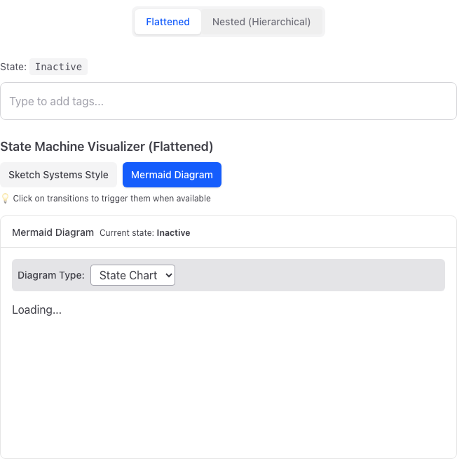

# HSM Combobox Visual Review

**Date:** 2024-12-26  
**Branch:** `visual-review-20251226`  
**Test:** `test/e2e/hsm-combobox-visual-review.spec.ts`

---

## Summary

Automated Playwright tests captured 68 screenshots covering mode tabs, widget states, visualizer tabs, and visualizer content through all machine states in light/dark themes with flat/nested modes.

### Critical Issues

| Issue | Severity | Category |
|-------|----------|----------|
| Mermaid visualizer fails - shows "Loading..." | 🔴 High | Functional |
| Visualizer tabs: inactive tab stays white in dark mode | 🟡 Medium | Theme |
| Sketch visualizer: nested states use white backgrounds in dark mode | 🟡 Medium | Theme |
| Widget: low contrast input borders both modes | 🟡 Medium | Accessibility |
| Dropdown overlaps visualizer heading (z-index) | 🟡 Medium | Layout |

---

## Screenshot Coverage

### State Walkthrough (sketch visualizer)
Each combination of theme × mode walks through 8 states:
1. Inactive
2. Active.Empty (focused)
3. Active.TextEntry (typing non-match)
4. Active.Suggesting (typing match)
5. Navigation highlight (arrow down)
6. Tag selected
7. Two tags added
8. Deactivated with tags

### Files Generated
```
sketch-{light,dark}-{flat,nested}-{1-8}-*.png   # 32 files
mermaid-{light,dark}-{flat,nested}-{1-3}-*.png  # 12 files  
mode-toggle-{light,dark}-{flat,nested}.png      # 4 files
viz-tabs-{light,dark}-{sketch,mermaid}.png      # 4 files
widget-{light,dark}-{state}.png                 # 8 files
```

---

## Detailed Findings

### 1. Mermaid Visualizer - BROKEN

All mermaid screenshots show "Loading..." with no diagram rendered.



**Status:** Non-functional across all configurations.

---

### 2. Sketch Visualizer - Generally Works

#### Light Mode ✅
- State highlighting works correctly (purple background on active state)
- Nested structure displays properly in nested mode
- Transitions visible as clickable buttons within states


#### Dark Mode Issues


**Problems:**
- Nested child states use **white backgrounds** - doesn't adapt to dark mode
- Low contrast on transition buttons inside active state (dark text on dark background)
- "path: Active.Suggesting" text is redundant clutter

---

### 3. UI-Visualizer Interplay ✅

State synchronization works correctly:
- Widget state changes immediately reflect in visualizer
- Current state label updates correctly
- Hierarchical path shows in nested mode (`Active.Suggesting`)

---

### 4. Widget Styling Issues

**Both modes:**
- Input border too faint
- State label disconnected from input

**Dark mode:**
- Suggestions dropdown overlaps visualizer heading (z-index issue)

---

### 5. Visualizer Tabs

**Issue:** Inactive tab stays white in dark mode

**Current code** (`HSMVisualizerDemo.tsx`):
```tsx
'bg-gray-100 text-gray-700 hover:bg-gray-200'  // Missing dark: variants
```

**Fix:**
```tsx
'bg-gray-100 dark:bg-gray-800 text-gray-700 dark:text-gray-300 hover:bg-gray-200 dark:hover:bg-gray-700'
```

---

## Design Recommendations

### Use Starlight Theme Tokens
Replace hardcoded Tailwind colors with CSS variables:

```css
/* Starlight provides these */
--sl-color-accent
--sl-color-bg
--sl-color-text
--sl-color-gray-1 through --sl-color-gray-6
```

### Headless UI Combobox Pattern
Reference the Headless UI Combobox for accessible, theme-aware patterns:
- Use `data-*` attributes for state styling
- Consistent focus/hover/selected states
- Proper ARIA attributes

---

## Running Tests

```bash
# Run all visual tests
npx playwright test test/e2e/hsm-combobox-visual-review.spec.ts

# View report
npx playwright show-report
```

Screenshots saved to `review/screenshots/hsm-combobox/`.

---

## Next Steps

1. Fix Mermaid syntax error
2. Add dark mode variants to visualizer tabs
3. Add dark mode support to sketch nested state boxes
4. Fix z-index on suggestions dropdown
5. Improve input border contrast
6. Consider migrating to Starlight CSS variables
